# Architecture visuelle du moteur métier des commandes Ordera

| Référence | Rôle |
| --- | --- |
| `OORDERA-ORDER-BUSINESS-ENGINE-SPECIFICATION.md` | Règles normatives détaillées |
| `OORDERA-ORDER-BUSINESS-DECISIONS.md` | Arbitrages produit validés |
| `OORDERA-ORDER-BUSINESS-ENGINE-IMPLEMENTATION-ROADMAP.md` | Ordre futur des lots |
| Ce document | Lecture graphique de l'architecture |

> Ce document ne remplace pas la spécification métier. Il permet d'en
> comprendre les flux, les autorités et les invariants en moins de quinze
> minutes.

## 1. Vue globale

Une commande entre par l'un des quatre canaux officiels. Quel que soit le
canal, elle produit le même parent et les mêmes lignes canoniques.

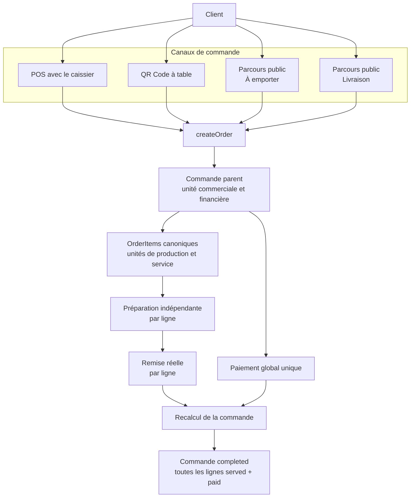

Le paiement et le service peuvent survenir dans un ordre différent selon le
canal. Ils convergent vers le même agrégateur.

---

# Comment Ordera réfléchit

Ordera transforme toujours une action d'interface en intention métier. L'écran
demande ; le moteur décide si l'action est valide.

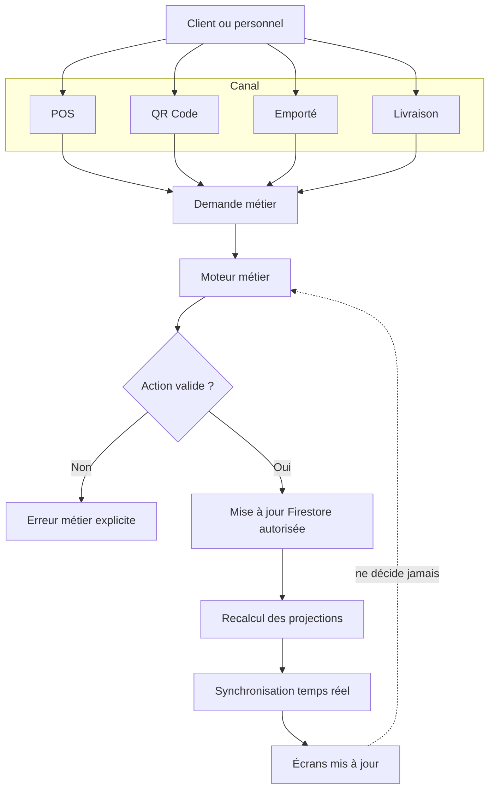

| Couche | Responsabilité |
| --- | --- |
| Écran | Capturer l'intention et présenter le résultat |
| Moteur métier | Appliquer les invariants et choisir la transition |
| Firestore | Persister l'état validé |
| Agrégateur | Recalculer la projection globale |
| Temps réel | Propager le nouvel état aux interfaces |

---

# Le cerveau d'Ordera

Les interfaces sont des portes d'entrée. Elles ne contournent jamais les
commandes métier pour modifier Firestore.

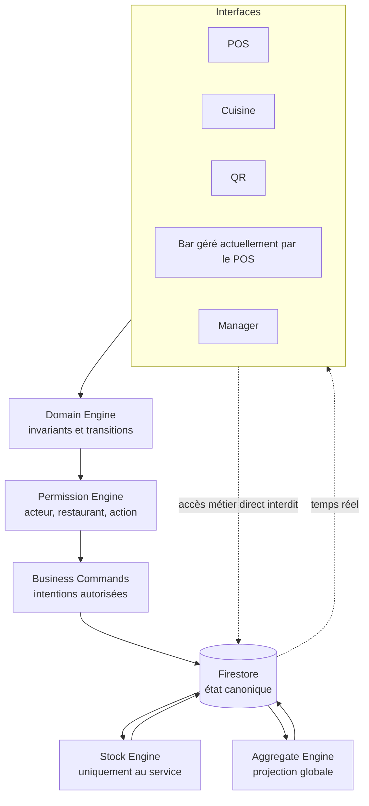

Le diagramme représente des responsabilités architecturales. Une commande
métier orchestre le domaine, les permissions et la transaction ; elle reste le
seul point d'entrée des mutations.

---

# Les quatre moteurs du système

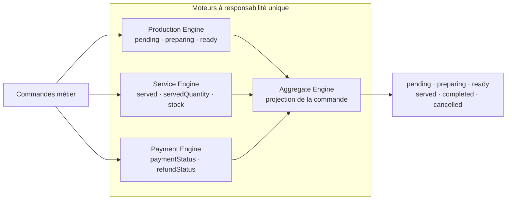

| Moteur | Responsabilité unique | Ne fait jamais |
| --- | --- | --- |
| Production Engine | Faire progresser une ligne jusqu'à `ready` | Servir, encaisser ou déduire le stock |
| Service Engine | Confirmer la quantité remise et traiter le stock associé | Confirmer un paiement |
| Payment Engine | Traiter paiement et remboursement | Préparer, servir ou déduire le stock |
| Aggregate Engine | Calculer la projection globale | Modifier une ligne ou une balance |

La séparation empêche qu'un paiement serve une ligne ou qu'une préparation
modifie le stock.

---

# Architecture des modules

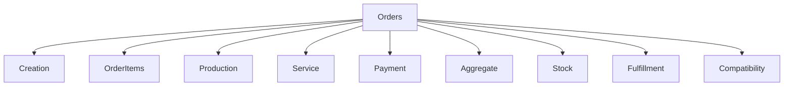

| Module | Rôle |
| --- | --- |
| Creation | Crée atomiquement le parent et les lignes canoniques avec des IDs stables |
| OrderItems | Porte l'autorité sur le cycle, les quantités et les acteurs d'une ligne |
| Production | Gère `pending → preparing → ready` selon `preparationMode` |
| Service | Gère la remise réelle, `servedQuantity` et le passage à `served` |
| Payment | Gère le paiement global et les remboursements, indépendamment du service |
| Aggregate | Recalcule le statut parent depuis les lignes et le paiement |
| Stock | Lie une quantité nouvellement servie à une opération Stock V2 idempotente |
| Fulfillment | Suit la remise et la confirmation d'une livraison |
| Compatibility | Lit les formats historiques sans les réparer ni en faire une autorité |

Une nouvelle fonctionnalité doit être rangée dans le module propriétaire de sa
responsabilité, puis exposée par une commande métier.

---

# La vie complète d'une commande

Ce scénario raconte une commande QR à table, de sa création à sa clôture.

```mermaid
sequenceDiagram
    actor Client
    participant QR as QR Code
    participant Create as createOrder()
    participant DB as Firestore
    participant Kitchen as Cuisine
    participant POS
    actor Server as Serveur physique
    participant Service as Service Engine
    participant Stock as Stock Engine
    participant Payment as Payment Engine
    participant Aggregate as Aggregate Engine

    Client->>QR: scanne le QR de la table
    Client->>QR: valide une commande unique
    QR->>Create: intention de création
    Create->>DB: créer le parent
    Create->>DB: créer tous les orderItems canoniques

    DB-->>Kitchen: lignes kitchen uniquement
    Kitchen->>DB: startOrderItemPreparation()
    Kitchen->>DB: markOrderItemReady()

    DB-->>POS: lignes direct et bar
    POS->>DB: préparer/rendre prêtes les boissons

    Server->>Client: remet physiquement les produits
    Server-->>POS: confirme verbalement la remise
    POS->>Service: markOrderItemServed()
    Service->>DB: mettre à jour la ligne
    Service->>Stock: déduire uniquement deltaServed
    Stock->>DB: balance + opération + progression + idempotence

    DB->>Aggregate: recalcul après chaque ligne
    Aggregate->>DB: toutes les lignes deviennent served

    Client->>Payment: paie l'addition globale
    Payment->>DB: confirmOrderPayment()
    DB->>Aggregate: recalculateOrderAggregate()
    Aggregate->>DB: completed
```

Le serveur transporte, mais ne saisit pas la commande et ne possède pas de
parcours métier obligatoire dans Ordera.

---

# Pipeline d'une commande métier

Toutes les commandes métier suivent la même chaîne de contrôle.

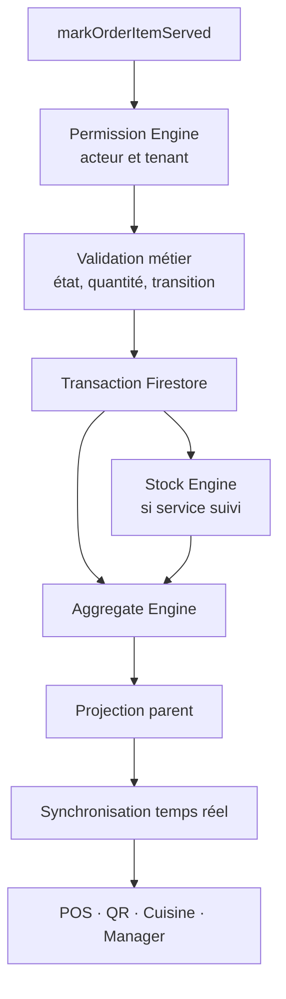

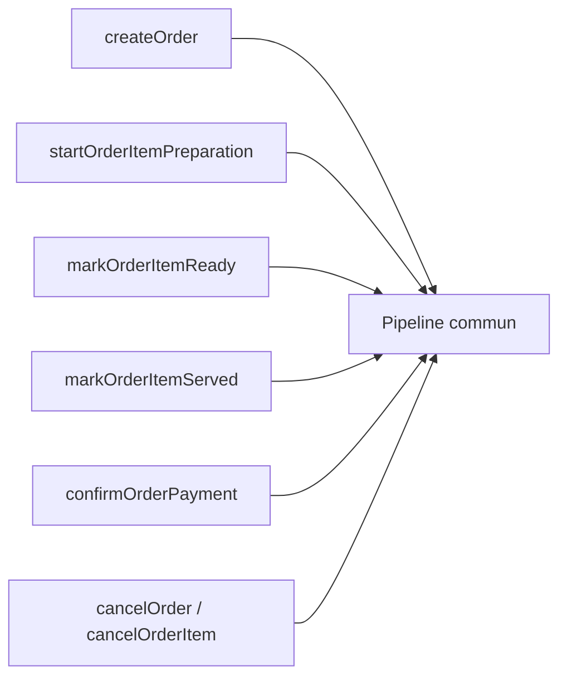

Certaines étapes deviennent neutres lorsqu'elles ne concernent pas la commande
appelée. Par exemple, le Stock Engine ne déduit rien pour `markOrderItemReady`
ou `confirmOrderPayment`.

---

## 2. Acteurs

Le diagramme distingue les actions dans Ordera des actions physiques réalisées
hors de l'application.

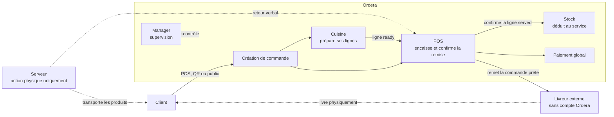

```text
Serveur : ne prend pas les commandes dans Ordera et ne possède aucun parcours
métier obligatoire.

Livreur : ne possède ni compte, ni portail, ni application Ordera.
```

---

## 3. Structure des données

### Autorité et projection

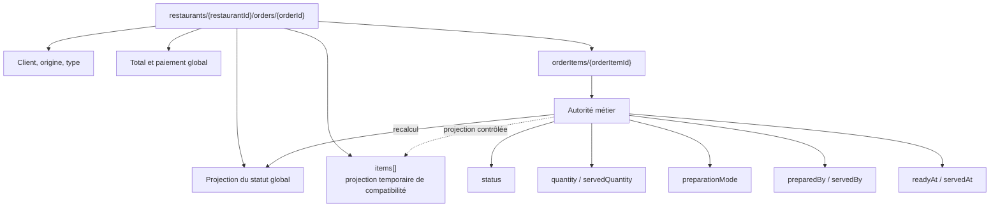

### Règle de lecture

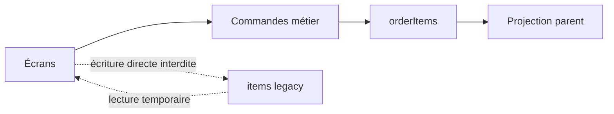

`orderItems` est l'autorité. `items[]` reste temporairement lisible pour la
compatibilité, mais ne constitue jamais une seconde autorité.

---

## 4. Cycle d'une ligne

### 4.1 Service direct

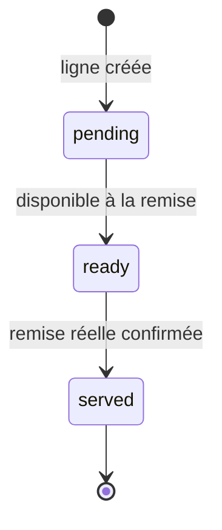

### 4.2 Cuisine

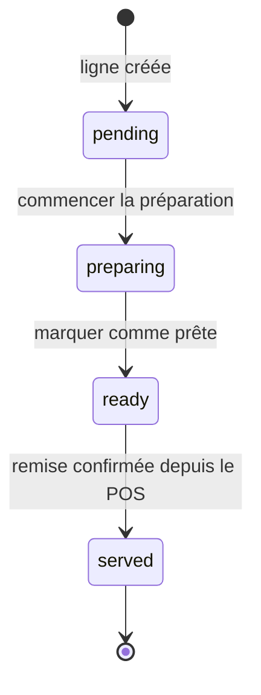

La Cuisine s'arrête obligatoirement à `ready` dans le périmètre actuel.

### 4.3 Bar

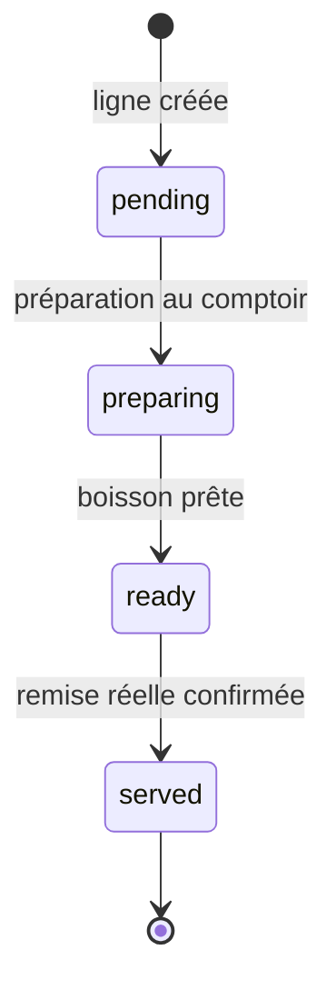

Le POS gère actuellement les lignes `preparationMode = bar`. Aucun poste Bar
autonome n'est créé.

### 4.4 Service partiel

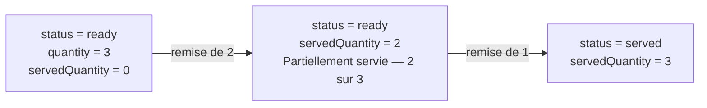

La ligne conserve `ready` tant que `servedQuantity < quantity`.

---

## 5. Cycle d'une commande

Le parent est recalculé à partir des lignes actives et du paiement.

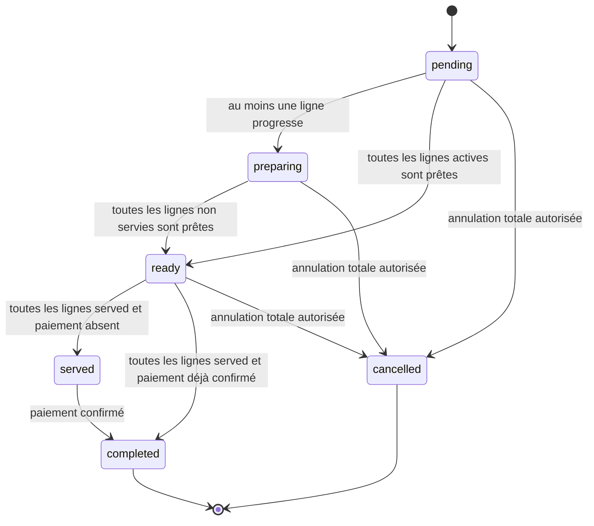

```text
completed = toutes les lignes actives entièrement servies + paiement confirmé
```

---

## 6. Commande mixte

### Scénario officiel

```text
Table 4
├── 2 Coca Cola — direct
├── 1 Pizza — cuisine
└── 1 Jus — bar
```

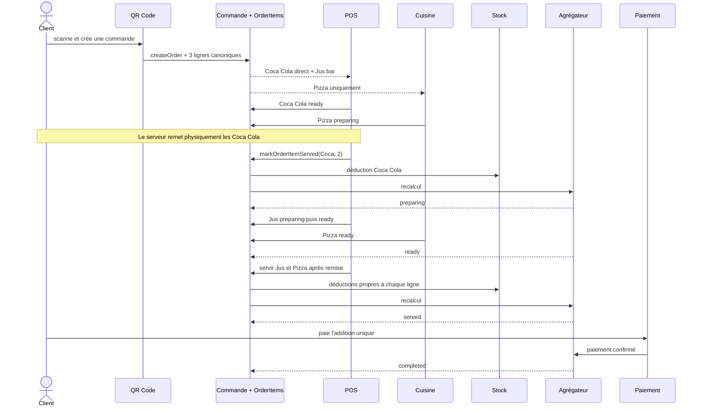

Chaque ligne progresse et déduit son propre stock. La commande reste ouverte
tant qu'une ligne active n'est pas entièrement servie.

---

## 7. Moteur de stock

### Transaction de service

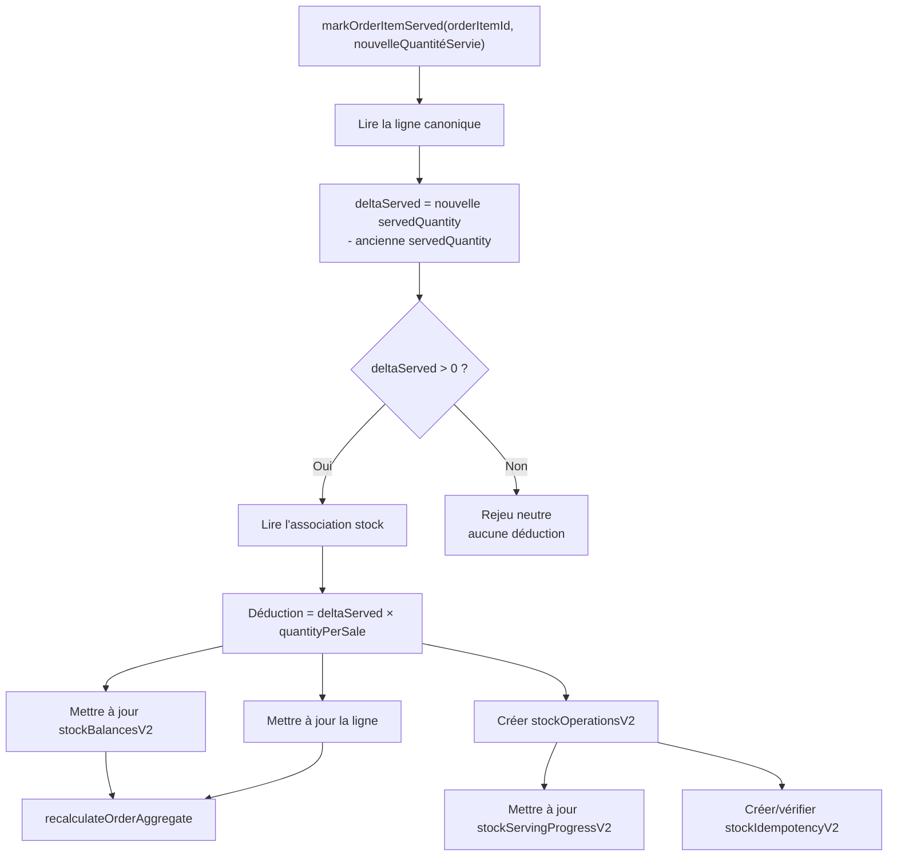

Les écritures de service, balance, opération, progression et idempotence
appartiennent à une même intention atomique.

### Transaction atomique détaillée

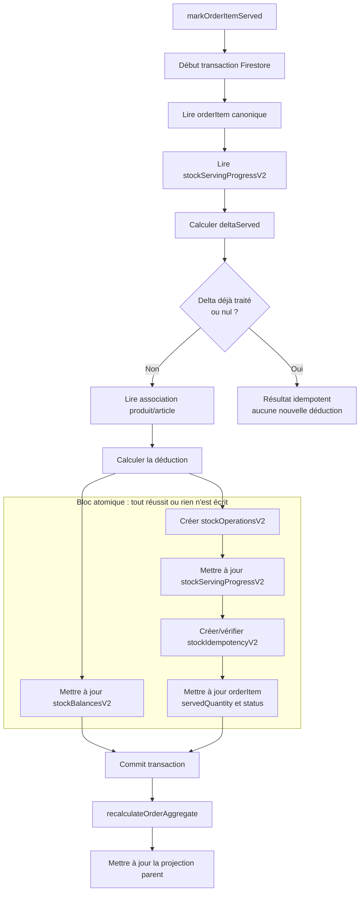

La commande de service constitue une intention logique unique :

- le bloc Firestore est atomique jusqu'au commit ;
- un échec annule toutes les écritures du bloc ;
- le rejeu retrouve la progression et reste neutre ;
- le recalcul déterministe du parent suit le commit ;
- aucun écran ne reconstitue lui-même cette transaction.

### Événements sans déduction

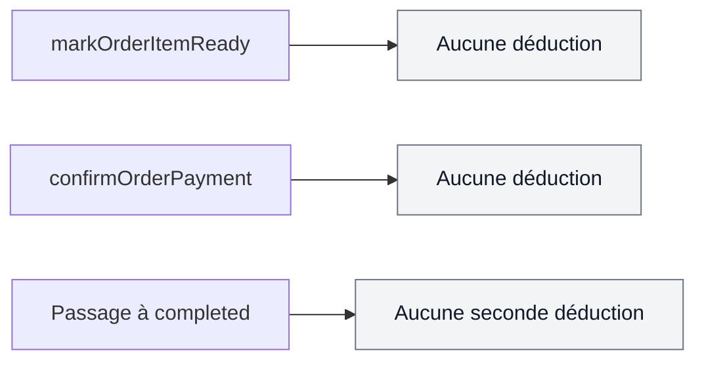

```text
Ready n'est pas Served.
Le paiement ne sert jamais.
Completed ne redéduit jamais.
```

---

## 8. Agrégateur

### Entrées et sortie

```mermaid
flowchart TD
    Items[OrderItems canoniques]
    Payment[paymentStatus]

    Items --> Aggregate[recalculateOrderAggregate]
    Payment --> Aggregate

    Aggregate --> Cancelled{Toutes les lignes annulées ?}
    Cancelled -->|Oui| C[cancelled]
    Cancelled -->|Non| AllServed{Toutes les lignes actives served ?}

    AllServed -->|Oui| Paid{Paiement confirmé ?}
    Paid -->|Oui| Completed[completed]
    Paid -->|Non| Served[served]

    AllServed -->|Non| AllReady{Toutes les lignes non servies ready ?}
    AllReady -->|Oui| Ready[ready]
    AllReady -->|Non| AllPending{Toutes les lignes pending ?}
    AllPending -->|Oui| Pending[pending]
    AllPending -->|Non| Preparing[preparing]
```

### Propriété essentielle

```mermaid
flowchart LR
    A[Ordre des actions A puis B] --> Result[Résultat final unique]
    B[Ordre des actions B puis A] --> Result
```

L'agrégateur ne modifie jamais les lignes et ne déduit jamais le stock.

---

## 9. Commandes métier

Les écrans expriment une intention. Ils n'écrivent jamais directement un
statut.

```mermaid
flowchart TD
    Screens[POS / QR / Cuisine / Manager]

    Screens --> Create[createOrder]
    Screens --> Start[startOrderItemPreparation]
    Screens --> Ready[markOrderItemReady]
    Screens --> Served[markOrderItemServed]
    Screens --> Payment[confirmOrderPayment]
    Screens --> CancelItem[cancelOrderItem]
    Screens --> CancelOrder[cancelOrder]

    Create --> Data[(Firestore)]
    Start --> Data
    Ready --> Data
    Served --> Data
    Payment --> Data
    CancelItem --> Data
    CancelOrder --> Data

    Create --> Aggregate[recalculateOrderAggregate]
    Start --> Aggregate
    Ready --> Aggregate
    Served --> Aggregate
    Payment --> Aggregate
    CancelItem --> Aggregate
    CancelOrder --> Aggregate

    DirectWrite[Écriture directe de status<br/>depuis un écran] -. interdite .-> Data
```

```mermaid
sequenceDiagram
    participant UI as Écran
    participant Command as Commande métier
    participant Rules as Permissions et invariants
    participant DB as Firestore
    participant Aggregate as Agrégateur

    UI->>Command: exprimer une intention
    Command->>Rules: valider acteur et transition
    Rules->>DB: mutation autorisée
    DB->>Aggregate: recalcul demandé
    Aggregate->>DB: écrire uniquement la projection parent
```

---

## 10. Canaux

### 10.1 POS

```mermaid
flowchart LR
    Create[Caissier crée la commande] --> Pay[Paiement immédiat]
    Pay --> Route{Mode de ligne}
    Route -->|direct| ReadyDirect[ready]
    Route -->|bar| PrepareBar[préparation POS] --> ReadyBar[ready]
    Route -->|kitchen| Kitchen[préparation Cuisine] --> ReadyKitchen[ready]
    ReadyDirect --> Handover[Remise confirmée depuis le POS]
    ReadyBar --> Handover
    ReadyKitchen --> Handover
    Handover --> Served[Toutes les lignes served]
    Served --> Completed[completed car paiement confirmé]
```

Le paiement précède généralement la remise, mais ne déduit rien.

### 10.2 QR à table

```mermaid
flowchart LR
    Scan[Client scanne le QR] --> Create[Client crée une commande unique]
    Create --> Split[OrderItems par mode]
    Split --> Prepare[Préparations indépendantes]
    Prepare --> Progressive[Services progressifs confirmés depuis le POS]
    Progressive --> AllServed[Toutes les lignes served]
    AllServed --> Waiting[Commande served<br/>paiement en attente]
    Waiting --> Pay[Paiement global]
    Pay --> Completed[completed]
```

Le serveur transporte les produits et informe verbalement le personnel. Aucun
compte Serveur n'est requis.

### 10.3 À emporter

```mermaid
flowchart LR
    Public[Client crée une commande publique] --> Pay[Paiement préalable obligatoire]
    Pay --> Prepare[Préparation]
    Prepare --> Ready[Prête à être remise]
    Ready --> Handover[Remise au client confirmée]
    Handover --> Stock[Déduction au service]
    Stock --> Completed[completed]
```

Une commande créée directement au POS peut être créée et payée immédiatement
au comptoir. Aucune politique configurable n'est introduite actuellement.

### 10.4 Livraison

```mermaid
flowchart TD
    Create[Client crée la livraison] --> Pay[Paiement préalable obligatoire]
    Pay --> Prepare[Préparation des lignes]
    Prepare --> Ready[ready_for_handover]
    Ready --> Handover[handed_to_courier<br/>personnel du restaurant]
    Handover --> Served[Lignes served]
    Served --> Stock[Déduction unique du stock]
    Stock --> Completed[Commande commerciale completed<br/>served + paid]
    Handover --> Delivery[Livraison physique<br/>sans compte Ordera]
    Delivery --> Confirm[delivery_confirmed<br/>personnel du restaurant]
    Confirm --> NoStock[Aucune seconde déduction]
```

`fulfillmentStatus` reste distinct du statut commercial de la commande.
Aucun compte Livreur, portail Livreur ou suivi GPS n'est requis.

---

## 11. Responsabilités

Le tableau décrit les actions **dans Ordera**. Une action physique hors
application est précisée dans les notes.

| Action | Client | POS | Cuisine | Bar | Serveur | Livreur | Manager |
| --- | --- | --- | --- | --- | --- | --- | --- |
| Créer une commande | **Autorisé** QR/public | **Autorisé** | Interdit | Interdit | Interdit | Interdit | Lecture |
| Préparer une ligne | Interdit | **Autorisé** direct/Bar | **Autorisé** Cuisine | Interdit actuellement | Interdit | Interdit | Lecture |
| Marquer `ready` | Interdit | **Autorisé** direct/Bar | **Autorisé** Cuisine | Interdit actuellement | Interdit | Interdit | Lecture |
| Confirmer `served` | Interdit | **Autorisé** | Interdit | Interdit actuellement | Interdit dans l'app | Interdit | Exception auditée |
| Encaisser | Paiement QR/public | **Autorisé** | Interdit | Interdit | Interdit | Interdit | Supervision |
| Modifier le stock | Interdit | Via commande de service | Interdit à `ready` | Interdit | Interdit | Interdit | Actions métier autorisées |
| Définir `completed` | Lecture | Lecture | Lecture | Lecture | Lecture | Lecture | Lecture |

### Lecture des rôles physiques

```mermaid
flowchart LR
    Server[Serveur sans parcours Ordera] -->|remet physiquement| Customer[Client]
    Server -->|informe verbalement| POS[Personnel au POS]
    POS -->|confirme served| Engine[Moteur]

    POS -->|remet au livreur| Courier[Livreur sans compte]
    Courier -->|livre physiquement| Customer
    POS -->|confirme fulfillment| Engine
```

`completed` est toujours produit par l'agrégateur. Aucun acteur ne l'écrit
directement.

---

## 12. Les 10 règles d'or du moteur Ordera

### 1. Une ligne est l'unité métier

Chaque `orderItem` possède son propre cycle de préparation et de service.

### 2. Une commande est l'unité commerciale

Elle regroupe le client, le canal, le total et une addition globale unique.

### 3. Le paiement ne sert jamais

Confirmer le paiement ne modifie ni `status`, ni `servedQuantity`, ni le stock.

### 4. `ready` n'est pas `served`

`ready` signifie prêt à remettre. `served` signifie réellement remis.

### 5. Le stock est déduit uniquement au service

```text
déduction = deltaServed × quantityPerSale
```

### 6. Le parent est une projection

Le statut global est recalculé depuis les lignes et le paiement.

### 7. `orderItems` est l'autorité

`items[]` n'est qu'une projection temporaire de compatibilité.

### 8. Les écrans utilisent uniquement les commandes métier

Aucun écran ne modifie directement les statuts ou la balance.

### 9. Toutes les lignes servies + paiement confirmé = `completed`

Ni le paiement seul, ni `ready`, ni une action globale ne suffisent.

### 10. Le moteur est identique pour tous les canaux

POS, QR, emporté et livraison créent les mêmes lignes et utilisent les mêmes
commandes métier, permissions, règles de stock et agrégateur.

```mermaid
flowchart LR
    POS[POS] --> Engine[Moteur unique]
    QR[QR Code] --> Engine
    Takeaway[Emporté] --> Engine
    Delivery[Livraison] --> Engine

    Engine --> Canonical[OrderItems canoniques]
    Engine --> Stock[Stock au service]
    Engine --> Aggregate[Agrégateur]
    Engine --> Payment[Paiement indépendant]
```

---

# Philosophie du moteur

```mermaid
mindmap
  root((Moteur Ordera))
    Source unique
      orderItems canoniques
      parent projeté
    Responsabilités séparées
      Production
      Service
      Paiement
      Agrégation
    Mutations contrôlées
      commandes métier
      permissions
      transactions
      idempotence
    Cohérence
      recalcul déterministe
      temps réel
      audit
    Tous les canaux
      POS
      QR
      Emporté
      Livraison
```

| Principe | Pourquoi il rend le moteur robuste |
| --- | --- |
| Une seule source de vérité | Deux écrans ne peuvent pas décider de deux états différents |
| Une responsabilité par moteur | Une évolution du paiement ne modifie pas la production ou le stock |
| Aucune logique métier dans les écrans | POS, QR et Cuisine appliquent exactement les mêmes règles |
| Aucun accès direct aux statuts | Les transitions invalides sont bloquées au même endroit |
| Mutations par commandes métier | Chaque action possède un nom, des permissions et un audit |
| Projections recalculées | Le résultat ne dépend pas de l'ordre d'action des interfaces |
| Stock indépendant du paiement | Seule une remise réelle peut consommer un article |
| Transactions idempotentes | Un rejeu réseau ou un double clic ne produit pas un second effet |
| Compatibilité isolée | L'historique reste lisible sans contaminer le modèle canonique |
| Moteur commun à tous les canaux | Une nouvelle entrée réutilise les invariants existants |

```mermaid
flowchart LR
    Intent[Intention] --> Command[Commande métier]
    Command --> Validate[Validation unique]
    Validate --> Persist[Persistance atomique]
    Persist --> Recalculate[Projection recalculée]
    Recalculate --> Explain[État explicable et auditable]
```

La robustesse vient moins du nombre de composants que de la clarté de leurs
frontières : chaque couche possède une responsabilité, chaque mutation possède
un chemin unique et chaque projection peut être reconstruite depuis les
données canoniques.
