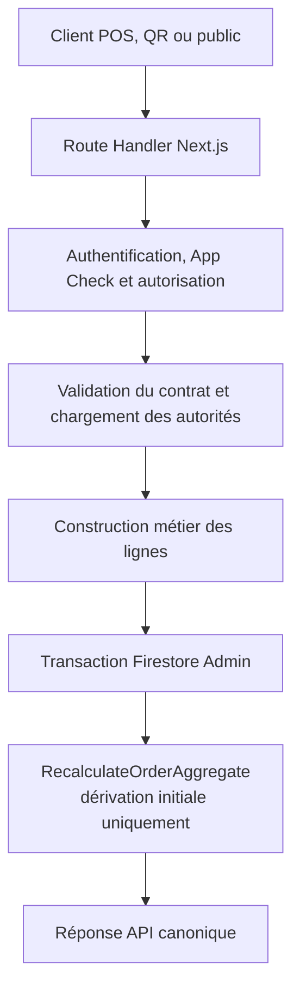
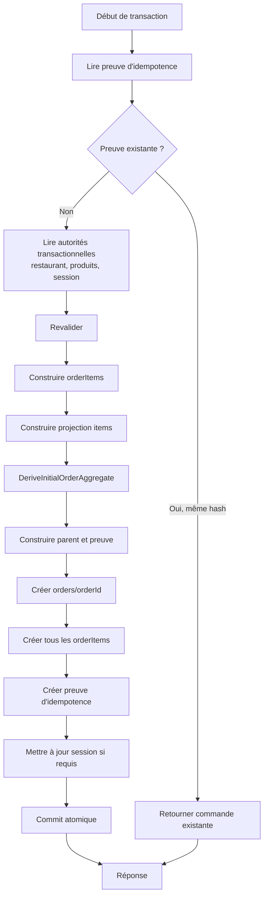

# LOT 1 — Design de la création canonique des commandes Ordera

## 0. Statut et portée

| Élément | Valeur |
|---|---|
| Nature | Spécification technique préalable à l'implémentation |
| Date | 29 juillet 2026 |
| Architecture imposée | Route Handler Next.js → service serveur → transaction Firestore Admin |
| Canaux | POS, salle, QR à table, emporté, livraison et futurs adaptateurs |
| Implémentation réalisée dans ce lot | Aucune |
| Modifications Firestore ou Rules | Aucune |

Ce document applique les décisions des LOT 0 et 0.5. Il ne rediscute pas la
frontière d'écriture : le navigateur transmet une intention et le serveur crée
la commande canonique.

## 1. Objectifs

### 1.1 Pourquoi ce lot existe

Le code actuel possède plusieurs créateurs incompatibles :

- le POS crée le parent, puis ses `orderItems` séquentiellement ;
- le QR à table crée uniquement le parent et `items[]` ;
- l'emporté et la livraison publics créent uniquement le parent ;
- une route legacy crée des sous-documents avec des IDs aléatoires ;
- un autre service legacy ne crée aucun sous-document.

Le moteur de service et de stock exige pourtant une ligne canonique stable dans
`orders/{orderId}/orderItems/{orderItemId}`. Le LOT 1 établit donc un seul
contrat de création, utilisable par tous les canaux.

### 1.2 Problèmes résolus

- une seule frontière de création ;
- validation serveur des intentions clientes ;
- recalcul serveur des prix ;
- création atomique du parent et de toutes les lignes ;
- IDs de ligne identiques dans `orderItems` et la projection `items[]` ;
- état initial déterminé par le serveur ;
- idempotence contre double clic, timeout et retry ;
- compatibilité temporaire avec les écrans lisant `items[]` ;
- erreurs stables et observables ;
- suppression progressive des écritures directes Firestore.

### 1.3 Problèmes non résolus dans ce lot

- transitions ultérieures de chaque ligne : LOT 2 ;
- agrégateur central après préparation, service ou paiement : LOT 3 ;
- limitation de la Cuisine à `ready` : LOT 4 ;
- UX de remise/service par canal : LOT 5 ;
- moteur de paiement et clôture : LOT 6 ;
- états logistiques de livraison : LOT 7 ;
- suppression de la projection `items[]` : LOT 8 ;
- migration ou interprétation complète des commandes historiques : LOT 9 ;
- annulation et remboursement par quantité : LOT 10.

Le LOT 1 dérive uniquement **l'agrégat initial** de la commande. Il ne doit pas
introduire prématurément le moteur d'agrégation du LOT 3.

## 2. Architecture générale

### 2.1 Vue logique



Dans ce diagramme, `RecalculateOrderAggregate` désigne le résultat logique
initial. Il ne provoque pas une seconde écriture après le commit. La valeur
initiale doit être calculée avant les écritures transactionnelles et incluse
dans le parent atomique.

### 2.2 Correction d'une séquence dangereuse

La séquence littérale suivante est interdite :

```text
commit parent + lignes
→ recalcul de l'agrégat
→ seconde mise à jour du parent
```

Elle créerait une fenêtre où les lignes existent avec un parent incohérent.
Elle contredirait l'atomicité du LOT 1. La séquence physique correcte est :

```text
validation et calculs
→ dérivation de l'agrégat initial
→ transaction de création complète
→ commit unique
→ réponse
```

Le nom définitif recommandé pour le calcul du LOT 1 est
`DeriveInitialOrderAggregate`. Le futur `RecalculateOrderAggregate` du LOT 3
pourra reprendre le même contrat de sortie, mais couvrira les mutations.

### 2.3 Séparation des responsabilités

| Couche | Responsabilité | Interdictions |
|---|---|---|
| Adaptateur client | Construire l'intention et gérer le retry | Prix, états, écritures Firestore |
| Route Handler | HTTP, taille, headers, mapping réponse | Calcul métier et accès UI |
| Sécurité serveur | Principal, restaurant, App Check, capacité QR | Faire confiance au body |
| Validateur | Schéma, bornes et cohérence du canal | Normalisation silencieuse de champs sensibles |
| Resolver | Charger produits, catégories, options, restaurant et sessions | Utiliser les snapshots du panier comme autorité |
| Builder métier | Construire parent, lignes, projection et agrégat initial | Écrire dans Firestore |
| Writer Admin | Transaction, idempotence et atomicité | Recalculer différemment du builder |
| Observabilité | Logs et métriques sans secrets | Effet métier dans le callback transactionnel |

## 3. Contrat d'entrée de l'API

### 3.1 Endpoint et transport

| Élément | Valeur |
|---|---|
| Méthode | `POST` |
| Route | `/api/restaurants/{restaurantId}/orders` |
| Content-Type | `application/json` uniquement |
| Version | champ `schemaVersion` obligatoire |
| Auth staff | `Authorization: Bearer <Firebase ID token>` |
| Public | Firebase Auth anonyme recommandé + `X-Firebase-AppCheck` |
| Idempotence | `Idempotency-Key` obligatoire |
| Capacité QR | en-tête ou objet dédié, jamais dans l'URL |

Le `restaurantId` appartient au chemin et ne doit pas être dupliqué dans le
corps. Une duplication créerait une ambiguïté de tenant.

### 3.2 Enveloppe

| Champ | Obligatoire | Type | Origine | Validation |
|---|---:|---|---|---|
| `schemaVersion` | Oui | entier | client SDK Ordera | Exactement une version supportée |
| `channel` | Oui | enum | adaptateur client | `pos`, `qr_table`, `public_takeaway`, `public_delivery` |
| `serviceMode` | Oui | enum | intention utilisateur/canal | `dine_in`, `takeaway`, `delivery` |
| `clientRequestId` | Oui | chaîne | client | UUID/format borné, corrélation uniquement |
| `items` | Oui | liste | panier | 1 à la limite métier configurée |
| `tableContext` | Conditionnel | objet | session QR/POS | obligatoire pour `dine_in` |
| `customer` | Conditionnel | objet | client | selon canal, champs bornés |
| `delivery` | Conditionnel | objet | client | obligatoire pour `delivery` |
| `cashSessionId` | Conditionnel | chaîne | POS | requis si la politique POS l'impose |
| `notes` | Non | chaîne | client | longueur et caractères contrôlés |

`Idempotency-Key` est un en-tête distinct de `clientRequestId` :

- `clientRequestId` sert à la corrélation des logs ;
- `Idempotency-Key` définit l'identité métier de la tentative.

### 3.3 Canal et mode de service

| Canal | Modes autorisés | Principal exigé |
|---|---|---|
| `pos` | `dine_in`, `takeaway`, `delivery` | personnel authentifié et autorisé |
| `qr_table` | `dine_in` uniquement | public, App Check, identité anonyme et capacité table |
| `public_takeaway` | `takeaway` uniquement | public, App Check et identité anonyme |
| `public_delivery` | `delivery` uniquement | public, App Check et identité anonyme |

Le serveur refuse une combinaison incohérente. Il ne la « corrige » pas.

« Salle » n'est pas un cinquième créateur : une commande de salle est un canal
POS avec `serviceMode=dine_in` et un contexte table valide. Cette règle évite
de recréer un moteur parallèle.

### 3.4 Lignes demandées

| Champ | Obligatoire | Type | Origine | Validation |
|---|---:|---|---|---|
| `clientLineId` | Oui | chaîne | panier | unique dans la requête, bornée |
| `productId` | Oui | ID Firestore sûr | panier | produit du restaurant |
| `quantity` | Oui | entier | utilisateur | strictement positif, plafonné |
| `options` | Non | liste | sélections | chaque choix résolu côté serveur |
| `instructions` | Non | chaîne | utilisateur | longueur bornée |
| `bundleContext` | Non | objet minimal | panier | information de regroupement, jamais tarifaire |

### 3.5 Options

Le schéma produit actuel identifie souvent les options par `name` et les choix
par `name`, sans ID stable. Le contrat LOT 1 accepte donc transitoirement :

| Champ | Obligatoire | Validation |
|---|---:|---|
| `optionName` | Oui | correspondance exacte normalisée dans le produit |
| `choiceName` | Oui | choix actif appartenant à l'option |

Le client n'envoie jamais `price`.

Le serveur snapshotte le libellé et le prix réellement configurés. Deux choix
de même nom dans une même option doivent rendre la configuration invalide, pas
produire un choix arbitraire.

L'introduction future de `optionId` et `choiceId` stables est recommandée. Elle
ne doit pas bloquer le LOT 1, mais le resolver doit être encapsulé afin de
remplacer la résolution par nom sans changer l'API métier.

### 3.6 Contexte table

| Champ | Obligatoire | Type | Validation |
|---|---:|---|---|
| `tableId` | Oui | ID sûr | table existante du restaurant |
| `tableSessionId` | Oui | ID sûr | session active de cette table et zone |
| `capability` | QR uniquement | jeton opaque/signé | portée, signature, expiration et révocation |

Pour un appel POS, la capacité QR n'est pas requise ; l'autorisation staff et la
session active sont requises.

### 3.7 Client et livraison

| Champ | Canal | Obligatoire | Validation |
|---|---|---:|---|
| `customer.name` | selon UX | Non | longueur, trim, caractères |
| `customer.phone` | livraison, éventuellement emporté | Oui pour livraison | format normalisé par pays |
| `delivery.address` | livraison | Oui | structure/longueur |
| `delivery.zoneId` | si zones configurées | Conditionnel | zone active du restaurant |
| `delivery.instructions` | livraison | Non | longueur bornée |

Le `deliveryFee` n'est jamais fourni comme autorité. Il est calculé depuis la
configuration du restaurant et la zone résolue.

### 3.8 Paiement

Le LOT 1 n'accepte aucun paiement confirmé.

Le corps ne contient pas :

- `paymentStatus` ;
- `paidAt` ;
- montant encaissé ;
- référence de transaction ;
- `paymentMode` faisant foi.

Une préférence de moyen de paiement, si l'UX la nécessite plus tard, doit être
une intention non confirmée traitée par le moteur de paiement séparé. Pour la
première implémentation du LOT 1, le paiement reste hors du contrat.

### 3.9 Champs explicitement interdits

Toute présence d'un de ces champs produit une erreur de validation :

- prix, prix unitaire ou prix d'option ;
- sous-total, total, remise, taxe, pourboire ou frais calculés ;
- `status`, `orderStatus`, `kitchenStatus` ;
- `servedQuantity`, `servedAt`, `servedBy` ;
- `preparationMode`, `requiresKitchen` ;
- article ou quantité de stock ;
- timestamps ;
- identifiants de documents canoniques choisis par le client ;
- paiement confirmé.

## 4. Contrat de sortie

### 4.1 Succès initial

Code HTTP : `201 Created`.

La réponse contient :

| Champ | Type | Sens |
|---|---|---|
| `ok` | booléen | `true` |
| `orderId` | chaîne | ID canonique |
| `displayId` | chaîne | référence utilisateur |
| `schemaVersion` | entier | version produite |
| `channel` | enum | canal accepté |
| `serviceMode` | enum | mode accepté |
| `orderStatus` | enum | agrégat initial |
| `paymentStatus` | enum | état initial non payé |
| `total` | nombre entier | total recalculé dans l'unité monétaire |
| `currency` | chaîne | devise restaurant |
| `orderItemIds` | liste | IDs canoniques |
| `idempotencyKey` | chaîne/empreinte non sensible | corrélation |
| `replayed` | booléen | `false` |
| `createdAt` | timestamp sérialisé | temps serveur |

### 4.2 Rejeu réussi

Code HTTP : `200 OK`.

La structure est identique au succès initial, avec `replayed=true`. Les champs
métier doivent être issus de la commande déjà créée, pas recalculés avec le menu
actuel.

### 4.3 Structure d'erreur

Toutes les erreurs exposent :

| Champ | Sens |
|---|---|
| `ok=false` | discriminant |
| `code` | code machine stable |
| `message` | message utilisateur sûr |
| `requestId` | corrélation support |
| `fieldErrors` | erreurs de champs, uniquement pour validation |
| `retryable` | indique si le même appel peut être retenté |

Les stacks, chemins internes, tokens et documents Firestore ne sont jamais
retournés.

### 4.4 Codes HTTP

| HTTP | Famille | Exemples |
|---:|---|---|
| 400 | JSON ou version invalide | `INVALID_JSON`, `UNSUPPORTED_SCHEMA` |
| 401 | identité/App Check absents ou invalides | `UNAUTHENTICATED`, `APP_CHECK_REQUIRED` |
| 403 | principal hors périmètre | `FORBIDDEN`, `INVALID_TABLE_CAPABILITY` |
| 404 | autorité non visible/inexistante | `RESTAURANT_NOT_FOUND`, `PRODUCT_NOT_FOUND` |
| 409 | conflit métier/idempotence | `IDEMPOTENCY_CONFLICT`, `TABLE_SESSION_INACTIVE` |
| 422 | intention syntaxiquement valide mais métier invalide | `PRODUCT_UNAVAILABLE`, `INVALID_OPTION` |
| 413 | requête trop grande | `PAYLOAD_TOO_LARGE` |
| 429 | anti-abus | `RATE_LIMITED` |
| 500 | défaut interne non exposé | `ORDER_CREATION_FAILED` |
| 503 | dépendance temporairement indisponible | `SERVICE_UNAVAILABLE` |

### 4.5 Caractère rejouable

- validation, permission ou conflit : `retryable=false` ;
- timeout inconnu après envoi : `retryable=true` avec la même clé ;
- contention Firestore épuisée : `retryable=true` ;
- erreur de configuration produit : `retryable=false` jusqu'à correction.

## 5. Validation serveur

### 5.1 Transport

- méthode POST ;
- Content-Type exact ;
- taille maximale du body ;
- JSON parseable ;
- version supportée ;
- aucun champ inconnu en mode strict ;
- nombre de lignes et taille des textes bornés.

### 5.2 Principal et tenant

- ID token staff vérifié pour le POS ;
- utilisateur actif ;
- appartenance au restaurant du chemin ;
- rôle autorisé ;
- session de caisse active si nécessaire ;
- App Check valide pour les canaux publics ;
- UID anonyme ou principal public reconnu ;
- capacité table valide pour le QR ;
- aucune confiance dans `restaurantId` fourni ailleurs.

### 5.3 Restaurant

- document existant ;
- statut actif ;
- abonnement autorisant la prise de commande ;
- service non suspendu ;
- canal activé ;
- devise et timezone configurées ;
- horaires et politique de fermeture appliqués selon la décision produit ;
- configuration de taxe/frais cohérente.

Un restaurant « fermé maintenant » doit avoir une règle explicite :

- public : rejet par défaut ;
- POS staff : autorisation éventuelle uniquement si la politique restaurant le
  permet.

### 5.4 Produits

Pour chaque ligne :

- ID sûr et unique par référence ;
- produit existant sous le restaurant ;
- produit actif/disponible ;
- catégorie existante et active si requise ;
- produit vendable dans le canal ;
- quantité entière positive et plafonnée ;
- options appartenant au produit ;
- options obligatoires présentes ;
- cardinalité respectée ;
- choix actifs et non ambigus ;
- configuration de prix numérique et non négative ;
- mode de préparation valide.

Le dépôt utilise actuellement `available` dans certains modèles et `isActive`
dans d'autres. Le resolver LOT 1 doit définir une règle canonique, testée et
documentée. Il ne doit pas considérer implicitement tout champ manquant comme
actif sans politique de compatibilité.

### 5.5 Table et session

- table existante ;
- restaurant correspondant ;
- zone correspondant à la table ;
- session existante et active ;
- pointeur de table cohérent ;
- capacité liée exactement à la session pour le QR ;
- session non expirée ;
- commande autorisée sur la session ;
- fermeture concurrente détectée dans la transaction.

### 5.6 Client et livraison

- téléphone normalisable ;
- adresse non vide et bornée ;
- zone desservie ;
- frais recalculés ;
- aucune livraison pour une configuration non active ;
- aucune donnée personnelle superflue ;
- notes nettoyées comme texte, jamais interprétées comme HTML.

### 5.7 Prix et montants

- prix de base lu du document produit ;
- options recalculées depuis le produit ;
- bundles recalculés depuis leur configuration ;
- remises issues d'une politique serveur et d'une autorisation ;
- taxe selon configuration ;
- frais de livraison selon zone ;
- arrondi monétaire unique ;
- sous-total égal à la somme des lignes ;
- total non négatif ;
- aucun montant du panier utilisé comme autorité.

### 5.8 Concurrence

Les documents dont la mutation invaliderait la commande doivent être lus dans
la transaction ou protégés par une version :

- restaurant/configuration commerciale ;
- produits et options ;
- table/session ;
- preuve d'idempotence.

Si un prix ou un état produit change pendant la tentative, la transaction est
rejouée et reconstruit la commande avec l'autorité à jour. La réponse présente
le montant effectivement accepté.

## 6. Résolution métier

### 6.1 Chargement

Le resolver reçoit les références validées et charge :

- restaurant ;
- produits uniques ;
- catégories nécessaires ;
- configurations d'options/bundles ;
- configuration commerciale ;
- table/session si applicable ;
- principal et autorisations.

Les lectures sont groupées. Aucun appel N+1 depuis le navigateur.

### 6.2 Prix

Pour chaque ligne :

1. lire le prix de base canonique ;
2. résoudre les options choisies ;
3. vérifier les options obligatoires ;
4. sommer les suppléments configurés ;
5. appliquer la règle bundle éventuelle ;
6. appliquer l'arrondi monétaire ;
7. multiplier par la quantité ;
8. conserver des snapshots historiques.

`recalculateConfiguredUnitPrice()` contient une base réutilisable, mais ne peut
pas être utilisé tel quel côté serveur : il accepte le prix fourni pour
certaines options inconnues dites taille/variante/supplément. Cette confiance
doit disparaître.

### 6.3 Taxes, remises et frais

- taxes : configuration serveur et règle d'arrondi définie une fois ;
- remise POS : identifiant de politique ou autorisation, jamais montant libre
  non borné ;
- remise publique : uniquement campagne serveur valide ;
- livraison : zone serveur ;
- pourboire : séparé et borné si le produit le prévoit, jamais implicitement
  taxable sans règle explicite.

Le code actuel n'expose pas encore un moteur tarifaire complet et unique. Si la
configuration taxe/remise n'est pas assez structurée au début du LOT 1, la
première version doit conserver les règles réellement supportées, pas inventer
des calculs silencieux.

### 6.4 Préparation

Ordre d'autorité :

1. `product.preparationMode` explicite et valide ;
2. éventuelle configuration canonique de catégorie ;
3. fallback legacy par catégorie uniquement pendant la migration, avec log ;
4. configuration ambiguë : rejet ou valeur conservatrice décidée explicitement.

Le client n'envoie jamais le mode.

Modes :

| Mode | État initial de ligne | `requiresKitchen` |
|---|---|---:|
| `kitchen` | `pending` | Oui |
| `bar` | `ready` ou état initial défini par décision Bar/POS | Non pour Cuisine |
| `direct` | `ready` | Non |

La décision validée confie le Bar au POS et non à la Cuisine. Si les documents
métier imposent `pending` pour le Bar, cette valeur devra être fixée avant
l'implémentation. Le builder ne doit pas utiliser un état implicite différent
selon le canal.

### 6.5 Identifiants

- `orderId` généré côté serveur avant le commit ;
- `orderItemId` généré côté serveur pour chaque ligne ;
- `clientLineId` conservé uniquement pour corrélation/audit ;
- même `orderItemId` dans le sous-document et `items[]` ;
- aucun `Date.now()+Math.random()` ;
- IDs sans information personnelle.

### 6.6 Document `orderItems`

Chaque ligne canonique contient au minimum :

- `id` et `orderItemId` identiques au document ;
- `orderId`, `restaurantId`, `productId` ;
- snapshots nom, prix, options et avis ;
- quantité commandée ;
- quantité annulée initiale à zéro ;
- quantité servie initiale à zéro ;
- mode de préparation résolu ;
- statut initial ;
- instructions ;
- sous-total ;
- timestamps serveur ;
- version de schéma.

La ligne ne contient pas de balance de stock ni de déduction pré-calculée.

### 6.7 Parent

Le parent contient :

- tenant, source/canal et serviceMode ;
- contexte table/client/livraison ;
- montants recalculés ;
- devise ;
- `orderStatus` initial dérivé ;
- paiement initial non payé ;
- `sessionActive` selon la politique ;
- projection `items[]` ;
- historique initial ;
- principal de création ;
- version de schéma ;
- timestamps serveur.

Les anciens champs `status` ne sont pas créés.

### 6.8 Agrégat initial

Règle minimale :

```text
au moins une ligne pending
  → orderStatus = pending

toutes les lignes immédiatement ready
  → orderStatus = ready

aucune commande ne naît served ou completed
```

Le paiement initial reste distinct. `completed` n'est jamais un résultat de
création.

## 7. Transaction Firestore

### 7.1 Diagramme physique



### 7.2 Projection et ordre des écritures

`items[]` est un champ du parent. Elle doit donc être construite avant
`transaction.create(orderRef, parent)` ; elle ne constitue pas une écriture
postérieure indépendante.

L'ordre d'appel des `transaction.create()` ne produit aucune visibilité
intermédiaire : Firestore publie toutes les écritures au commit ou aucune.

### 7.3 Pourquoi c'est atomique

- toutes les lectures critiques sont dans la transaction ;
- tous les documents canoniques sont créés dans la même transaction ;
- `create` échoue si une cible existe ;
- une modification concurrente d'une autorité lue provoque un retry ;
- la preuve d'idempotence est créée avec la commande ;
- une erreur avant commit n'écrit rien ;
- une erreur de réponse après commit est résolue par le rejeu idempotent.

### 7.4 Documents inclus

Obligatoires :

- `orders/{orderId}` ;
- `orders/{orderId}/orderItems/{orderItemId}` pour chaque ligne ;
- `orderCreationIdempotency/{stableHash}`.

Conditionnels :

- mise à jour de la session de table ;
- document d'accès au suivi/avis si cette preuve est indispensable dès la
  création et peut être créée sans secret exposé.

Interdits :

- balance ou opération de stock ;
- paiement confirmé ;
- fidélité ;
- notifications externes ;
- impression ;
- analytics dérivées.

Ces effets postérieurs doivent être idempotents et déclenchés après succès,
sans conditionner l'existence de la commande.

## 8. Idempotence

### 8.1 Clé

- générée avant le premier appel ;
- cryptographiquement aléatoire ou UUID ;
- stable pendant tous les retries de la même intention ;
- différente pour une nouvelle intention ;
- longueur et alphabet bornés ;
- jamais dérivée uniquement de l'heure.

Scope :

```text
restaurantId + principalId + channel + Idempotency-Key
```

Pour le QR, `tableSessionId` entre dans le principal logique.

### 8.2 Hash de requête

Le serveur canonicalise les champs d'intention pertinents et calcule un hash.
Sont exclus :

- ordre des clés JSON ;
- `clientRequestId` ;
- tokens ;
- métadonnées de transport.

Sont inclus :

- canal et mode ;
- lignes, quantités et options ;
- contexte table/livraison ;
- données client métier nécessaires.

### 8.3 Stockage

Chemin proposé :

```text
restaurants/{restaurantId}/orderCreationIdempotency/{stableHash}
```

Contenu :

- scope et empreinte de clé ;
- hash de requête ;
- `orderId` ;
- principal et canal ;
- timestamp ;
- version ;
- date d'expiration technique éventuelle.

La clé brute n'est pas nécessaire dans les logs.

### 8.4 Rejeu

| Situation | Résultat |
|---|---|
| Même clé, même hash, commande existante | réponse canonique existante, `replayed=true` |
| Même clé, hash différent | `409 IDEMPOTENCY_CONFLICT` |
| Preuve existe, commande absente | anomalie critique, aucune nouvelle commande automatique |
| Commande existe, preuve absente | impossible après transaction LOT 1 ; signaler corruption |
| Deux appels simultanés | une transaction gagne, l'autre rejoue |

### 8.5 Timeout et retry

Si le client ne sait pas si le commit a réussi :

- ne pas générer une nouvelle clé ;
- rejouer exactement la même intention ;
- recevoir la même commande si elle existe ;
- ne pas afficher deux confirmations.

### 8.6 Durée

La preuve doit rester au minimum pendant la fenêtre maximale de retry et de
support. Recommandation initiale : 7 jours, à valider avec l'exploitation.

Un TTL éventuel ne supprime jamais la commande. Après expiration de la preuve,
le client ne doit plus réutiliser la clé. Les commandes historiques restent
immutables.

### 8.7 Réponse identique

Le rejeu lit le snapshot de la commande créée. Il ne recalcule pas les prix
actuels. Les champs de création retournés restent identiques ; seul
`replayed=true` et le `requestId` courant peuvent différer.

## 9. Compatibilité temporaire

### 9.1 Autorités

| Objet | Rôle LOT 1 |
|---|---|
| `orderItems` | autorité métier des lignes |
| `orders.items[]` | projection de compatibilité |
| parent `orders` | agrégats, contexte et paiement |

### 9.2 Écriture

Seul le builder serveur construit les lignes initiales et la projection.
Après création :

- les moteurs de ligne canoniques écrivent `orderItems` ;
- la synchronisation temporaire de `items[]` reste contrôlée ;
- aucun écran ne modifie directement `items[]`.

Le LOT 1 verrouille la création, mais la suppression de tous les écrivains de
projection pendant le cycle de vie appartient aux LOT 2, 3 et 8.

### 9.3 Lecture

Pendant le LOT 1 :

- POS, Cuisine, Manager, Owner et suivi public peuvent encore lire `items[]` ;
- le moteur de stock continue à lire `orderItems` ;
- les nouvelles fonctions métier doivent préférer `orderItems` ;
- les commandes historiques sans sous-documents restent lues par les
  adaptateurs legacy.

### 9.4 Invariant de projection à la création

Pour chaque index :

- même `orderItemId` ;
- même `productId` ;
- même quantité ;
- même prix snapshot ;
- même mode ;
- même état initial ;
- mêmes options snapshotées.

Un test compare les deux représentations champ par champ.

### 9.5 Disparition

`items[]` ne disparaît pas au LOT 1. Le LOT 8 :

1. migre les lecteurs ;
2. mesure les dépendances restantes ;
3. rend la projection facultative pour les nouvelles commandes ;
4. conserve l'historique legacy ;
5. décide séparément de sa suppression physique.

## 10. Migration des canaux

| Canal | Ancien fonctionnement | Nouveau fonctionnement | Statut initial |
|---|---|---|---|
| POS | `OrderService.createOrder()`, parent puis lignes | adaptateur API staff, transaction serveur | premier canal pilote |
| Salle | même créateur POS avec contexte table | même API `pos+dine_in`, session validée | inclus dans pilote POS |
| QR | transaction cliente parent-only | API publique, App Check, UID anonyme, capacité table | bloqué par sécurité préalable |
| Emporté | POS partiel ou public parent-only | même API avec canal POS/public | après pilote |
| Livraison | POS partiel ou public parent-only | même API avec validation livraison | après emporté |

### 10.1 Ordre recommandé

1. service et tests sans UI ;
2. POS comptoir ;
3. salle POS ;
4. sécurité publique et capacité QR ;
5. QR à table ;
6. emporté public ;
7. livraison publique ;
8. routes legacy ;
9. verrouillage Rules et garde-fous statiques.

### 10.2 Pas de fallback legacy

Un canal migré ne doit jamais exécuter :

```text
échec API → ancien createOrder Firestore
```

Il conserve le panier et propose un retry avec la même clé.

## 11. Sécurité

### 11.1 Firebase Auth staff

Réutiliser la vérification Admin du jeton, puis ajouter :

- utilisateur racine existant et actif ;
- document staff du restaurant ;
- rôle actif autorisé ;
- concordance du tenant ;
- session caisse si nécessaire.

`requireFirebaseUser()` seul est insuffisant : il authentifie l'UID mais ne
prouve pas son autorisation sur le restaurant.

### 11.2 Firebase Auth anonyme

Recommandé pour les canaux publics afin de :

- stabiliser le principal pendant les retries ;
- scoper l'idempotence ;
- faciliter le rate limiting ;
- corréler sans données personnelles.

Le helper d'auth anonyme existe dans le dépôt, mais aucun appel actif n'a été
trouvé. L'activation du provider et son intégration doivent être validées avant
la migration publique.

### 11.3 App Check

Obligatoire pour QR, emporté et livraison publics :

- jeton transmis en en-tête ;
- vérifié par Firebase Admin ;
- mode monitor avant enforcement ;
- enforcement avant ouverture générale ;
- protection anti-rejeu limitée évaluée sans remplacer l'idempotence.

### 11.4 Capacité QR

Le `tableId` n'est pas un secret.

La capacité :

- est émise côté serveur ;
- lie restaurant, table, session et expiration ;
- est non forgeable ;
- est invalidée lorsque la session ferme ;
- n'est pas loggée ;
- ne donne aucun droit hors de `CreateOrder` pour cette session.

L'API actuelle de création de session de table doit être durcie avant le canal
QR. Son schéma transactionnel peut être réutilisé, pas son niveau de sécurité
actuel.

### 11.5 Admin SDK

Admin contourne les Rules. Par conséquent :

- aucun input brut n'arrive au writer ;
- les types serveur distinguent intention validée et document persistable ;
- le writer n'est appelé qu'après autorisation ;
- les tests d'intégration serveur remplacent la protection Rules pour cette
  écriture ;
- le module reste server-only.

### 11.6 Ownership restaurant

Le service reproduit explicitement les invariants utiles des Rules :

- `users/{uid}.restaurantId` ;
- ou `restaurants/{restaurantId}/staff/{uid}` actif ;
- rôle autorisé ;
- owner vérifié selon le modèle canonique.

Les règles exactes ne doivent pas être recopiées indépendamment dans plusieurs
Route Handlers. Un resolver d'autorisation serveur unique est nécessaire.

### 11.7 Anti-abus

- rate limit par UID, IP hachée, restaurant, session et canal ;
- nombre de lignes, quantité et taille bornés ;
- App Check ;
- capacité QR ;
- idempotence ;
- erreurs sans oracle détaillé sur les produits d'un autre restaurant ;
- métriques de rejet ;
- pas de CORS comme mécanisme de sécurité.

### 11.8 Firestore Rules après migration

Lorsque tous les canaux utilisent l'API :

- refuser la création directe de `orders` par navigateur ;
- conserver le refus public de création de `orderItems` ;
- préserver les lectures nécessaires ;
- tester les mutations ultérieures séparément.

La modification effective des Rules ne fait pas partie de ce document.

## 12. Audit des éléments existants

### 12.1 Réutilisables

| Élément | Réutilisation | Condition |
|---|---|---|
| `src/server/firebase-admin.ts` | initialisation Admin | conserver server-only et tests de configuration |
| `src/server/auth/api-auth.ts` | vérification ID token | enrichir avec tenant/rôle |
| Route Handler de sessions de table | modèle de transaction Admin | durcir auth/capacité/logs |
| `orderHasKitchenItems()` | calcul pur | alimenté avec modes résolus serveur |
| types `PreparationMode` | enum `kitchen/direct/bar` | déplacer/partager sans dépendance UI |
| `normalizeOrderType()` | lecture legacy | ne pas l'utiliser pour corriger silencieusement le nouveau contrat |
| `recalculateConfiguredUnitPrice()` | logique de base | supprimer toute confiance dans prix client |
| constantes de statut | vocabulaire initial | réduire les aliases dans le contrat serveur |
| logique d'idempotence du ledger/stock | inspiration | nouvelle preuve dédiée à la création |
| Firebase emulator et tests Rules existants | infrastructure de tests | ajouter suites API/Admin |

### 12.2 À remplacer comme créateurs

| Élément | Action cible |
|---|---|
| `OrderService.createOrder()` dans `src/services/order.service.ts` | remplacer par client API ; ne plus écrire |
| `createOrder()` dans `src/services/orderService.ts` | retirer après migration legacy |
| `POSClient.handleCheckout()` | conserver UX, remplacer l'appel de persistance |
| `CheckoutQRModal` | supprimer transaction parent directe |
| `CheckoutPublicModal` | supprimer batch parent direct |
| `/r/[slug]/checkout` | raccorder ou rediriger |
| `/(public)/checkout` | raccorder ou supprimer |

### 12.3 À consolider

Le dépôt possède des modèles `Order`/`RestaurantOrder`/`OrderItem` divergents
dans :

- `src/types.ts` ;
- `src/types/index.ts` ;
- `src/modules/restaurant/types.ts` ;
- `src/services/order.service.ts`.

Le LOT 1 doit introduire des contrats serveur dédiés :

- intention API ;
- commande résolue ;
- document parent ;
- document de ligne ;
- réponse publique.

Ils ne doivent importer ni types de composants React ni types permissifs
legacy.

### 12.4 Utilitaires non sûrs tels quels

- `getEffectivePreparationMode()` utilise des heuristiques de noms ;
- `getDefaultPreparationMode()` suppose Cuisine par défaut ;
- `recalculateConfiguredUnitPrice()` peut faire confiance à certains prix
  d'options clients ;
- les types de disponibilité alternent `available` et `isActive` ;
- les statuts normalisent plusieurs valeurs historiques.

Ces fonctions restent utiles aux écrans legacy, mais le nouveau builder doit
avoir des règles strictes et testées.

### 12.5 Route Handlers existants

Le projet possède déjà des routes :

- authentifiées pour restaurants, staff et administration ;
- publiques en lecture ;
- une route Admin transactionnelle de session de table.

Il ne possède aucune route canonique de création de commande. La nouvelle route
doit suivre les conventions serveur existantes tout en ajoutant schéma strict,
App Check, idempotence et erreurs structurées.

## 13. Tests obligatoires

### 13.1 Contrat

- JSON vide/invalide ;
- version absente/inconnue ;
- champ inconnu ;
- canal/mode incohérents ;
- zéro ligne ;
- nombre maximal et dépassement ;
- chaîne trop longue ;
- ID contenant un chemin ;
- quantité zéro, négative, décimale, NaN ou excessive ;
- champ prix/statut interdit.

### 13.2 Authentification et tenant

- staff valide du restaurant ;
- staff d'un autre restaurant ;
- utilisateur désactivé ;
- rôle non autorisé ;
- token expiré/invalide ;
- session caisse absente/fermée ;
- appel public sans App Check ;
- App Check invalide ;
- UID anonyme absent selon politique ;
- capability QR falsifiée, expirée, autre table ou session fermée.

### 13.3 Restaurant

- inexistant ;
- suspendu ;
- abonnement non autorisé ;
- fermé au public ;
- canal désactivé ;
- devise/configuration invalide ;
- changement de statut concurrent.

### 13.4 Produits et options

- produit inexistant ;
- produit d'un autre restaurant ;
- produit supprimé entre panier et submit ;
- produit inactif ;
- catégorie inactive ;
- option obligatoire absente ;
- option inconnue ;
- choix inconnu/inactif ;
- noms d'options ambigus ;
- prix produit modifié avant submit ;
- prix modifié pendant transaction ;
- préparation invalide ;
- bundle incomplet ;
- instructions trop longues.

### 13.5 Calcul

- prix de base ;
- plusieurs options ;
- quantité multiple ;
- arrondis ;
- taxe ;
- remise autorisée/refusée ;
- frais de livraison ;
- total zéro autorisé ou refusé selon politique ;
- total négatif impossible ;
- absence totale de confiance dans le total client.

### 13.6 États initiaux

- tout direct → `ready` ;
- au moins une ligne Cuisine → `pending` ;
- commande mixte ;
- Bar selon décision finale ;
- aucune commande créée `served` ;
- aucune commande créée `completed` ;
- `servedQuantity=0` partout ;
- paiement initial non payé.

### 13.7 Atomicité

- échec avant première écriture ;
- échec logique sur la dernière ligne ;
- cible parent déjà existante ;
- cible ligne déjà existante ;
- transaction interrompue ;
- contention produit/session ;
- aucune commande sans toutes ses lignes ;
- aucune preuve sans commande ;
- aucune projection partielle ;
- aucune opération stock/paiement.

### 13.8 Idempotence

- double clic séquentiel ;
- double clic concurrent ;
- retry après timeout avant commit ;
- retry après commit mais avant réponse ;
- même clé/même body ;
- même clé/body différent ;
- même clé, autre restaurant ;
- même clé, autre principal ;
- même clé, autre session QR ;
- preuve corrompue ;
- expiration/TTL ;
- réponse rejouée portant les snapshots historiques.

### 13.9 Table et QR

- table valide ;
- session valide ;
- session fermée avant transaction ;
- fermeture concurrente ;
- mauvais zoneId ;
- mauvais pointeur table/session ;
- capability volée pour autre restaurant ;
- plusieurs commandes légitimes dans la même session avec clés distinctes.

### 13.10 Performance et limites

- requête maximale autorisée ;
- commande énorme refusée avant lectures coûteuses ;
- produits dupliqués chargés une fois ;
- pic concurrent ;
- latence p95 ;
- retries transactionnels ;
- configuration App Hosting à une instance évaluée ;
- rate limit.

### 13.11 Migration par canal

- POS comptoir ;
- salle POS ;
- QR table ;
- emporté POS/public ;
- livraison POS/publique ;
- route legacy bloquée ou raccordée ;
- aucun appel direct Firestore ;
- aucun fallback parent-only.

### 13.12 Garde-fous statiques

Tests/recherches empêchant :

- `addDoc`/`setDoc` vers `orders` hors writer autorisé ;
- création de `orderItems` hors writer ;
- import du service legacy dans un créateur actif ;
- prix fourni dans le contrat client ;
- dépendance du service serveur envers React ou Firebase Web SDK.

## 14. Risques techniques

| Risque | Niveau | Réponse LOT 1 |
|---|---|---|
| Admin contourne les Rules | Critique | validation serveur typée + tests |
| App Check absent | Critique public | monitor puis enforcement |
| session QR non signée | Critique QR | capacité bornée obligatoire |
| modèles Order dupliqués | Élevé | contrats serveur dédiés |
| prix d'option client encore accepté | Élevé | resolver strict |
| options sans IDs stables | Élevé | résolution serveur transitoire + plan IDs |
| disponibilité `available/isActive` | Élevé | politique canonique |
| préparation par heuristique | Élevé | autorité produit, fallback journalisé |
| `maxInstances: 1` | Élevé | test charge et configuration avant rollout |
| transaction avec trop de lignes | Moyen | plafond explicite |
| effets post-commit dupliqués | Moyen | événements idempotents ultérieurs |
| interfaces encore sur `items[]` | Moyen | projection atomique jusqu'au LOT 8 |
| offline | Moyen | panier local, confirmation serveur obligatoire |
| deux services homonymes | Moyen | suppression/import guard |

## 15. Décisions à figer avant implémentation

Le design est complet, mais quatre valeurs produit doivent être inscrites comme
constantes/politiques avant le premier code :

1. nombre maximal de lignes par commande ;
2. quantité maximale par ligne ;
3. état initial exact d'une ligne `bar` ;
4. durée de conservation de la preuve d'idempotence.

Valeurs recommandées pour démarrer les tests :

- 50 lignes ;
- 999 unités par ligne ;
- Bar `ready`, géré par POS ;
- preuve 7 jours.

Ces valeurs ne doivent pas rester des nombres dispersés.

## 16. Critères GO / NO-GO

### 16.1 GO pour commencer l'implémentation

L'implémentation peut commencer si :

- ce document et l'architecture LOT 0.5 sont validés ;
- les quatre politiques de la section 15 sont fixées ;
- le schéma d'options transitoire par nom est accepté ;
- la règle de disponibilité produit est définie ;
- le périmètre du premier pilote POS est confirmé ;
- le futur emplacement des contrats serveur est accepté ;
- l'environnement local peut exécuter Firebase Admin et les émulateurs.

### 16.2 GO pour migrer le premier canal

- service pur testé ;
- transaction Admin testée ;
- idempotence concurrente testée ;
- parent/lignes/projection identiques ;
- aucune écriture stock/paiement ;
- authentification restaurant testée ;
- observabilité disponible ;
- ancien fallback désactivé pour ce canal.

### 16.3 GO pour les canaux publics

- App Check activé et vérifié ;
- Auth anonyme/politique de principal active ;
- rate limiting opérationnel ;
- capacité QR opérationnelle pour `qr_table` ;
- API de session durcie ;
- tests d'abus réussis ;
- capacité App Hosting validée.

### 16.4 NO-GO

- écriture directe Firestore restante dans un canal déclaré migré ;
- prix, préparation ou statut acceptés du client ;
- création parent puis lignes hors transaction ;
- recalcul écrivant le parent après commit ;
- `orderItems` publiquement créables ;
- absence d'idempotence ;
- Route Handler contenant directement tout le métier ;
- principal staff non vérifié contre le restaurant ;
- QR protégé seulement par `tableId` ;
- App Check considéré comme identité ;
- fallback legacy ;
- suppression de `items[]` dans ce lot ;
- modification du stock ou paiement pendant la création ;
- commande initialisée `completed`.

## 17. Structure d'implémentation proposée

Cette arborescence est informative, pas créée par ce lot :

```text
src/server/orders/
  contracts/
    create-order-request
    create-order-response
  application/
    create-order-service
    derive-initial-order-aggregate
  domain/
    resolved-order
    order-errors
    order-policies
  infrastructure/
    firestore-order-authorities
    firestore-order-writer
    order-idempotency
  security/
    resolve-order-principal
    verify-app-check
    verify-table-capability

src/app/api/restaurants/[restaurantId]/orders/route
```

Le service applicatif reçoit des ports, pas `NextRequest`, React ou le SDK
Firestore Web. Le Route Handler mappe HTTP vers le service.

## 18. Livrable d'implémentation attendu au terme du LOT 1

Le futur LOT 1 implémenté devra fournir :

- un endpoint unique ;
- un contrat versionné ;
- un principal serveur unifié ;
- un resolver de produit/prix/préparation ;
- une transaction atomique ;
- une preuve d'idempotence ;
- une projection compatible ;
- les adaptateurs de tous les canaux ;
- les garde-fous statiques ;
- les tests unitaires, intégration, Rules et sécurité ;
- un rapport de migration par canal ;
- aucune déduction de stock ;
- aucun paiement implicite ;
- aucune création legacy.

## 19. Conclusion

La création canonique d'une commande n'est plus une opération Firestore
effectuée par un écran. C'est une commande métier serveur :

```text
intention non fiable
→ principal vérifié
→ autorités chargées
→ prix et préparation résolus
→ lignes canoniques construites
→ agrégat initial dérivé
→ parent + lignes + idempotence atomiques
→ réponse rejouable
```

Cette frontière prépare les LOT 2 et 3 sans les implémenter. Elle conserve
temporairement `items[]`, protège le moteur de stock et empêche qu'un canal
public fabrique lui-même les objets canoniques.
