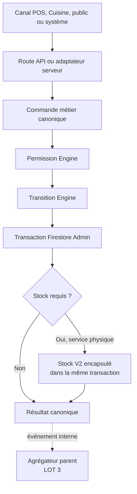
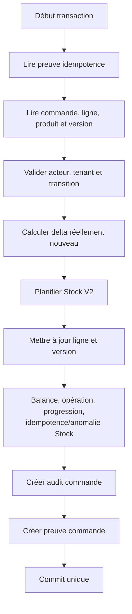

# LOT 2 — Design des commandes métier canoniques Ordera

## 0. Statut

| Élément | Valeur |
|---|---|
| Nature | Spécification technique, sans implémentation |
| Date | 29 juillet 2026 |
| Autorité des lignes | `orders/{orderId}/orderItems/{orderItemId}` |
| Frontière d'écriture | API/service serveur → transaction Firestore Admin |
| Écrans migrés dans ce lot | Aucun |
| Code, Rules, données ou tests modifiés | Aucun |

Ce document définit toutes les mutations métier postérieures à la création
canonique. Il complète le LOT 1 sans implémenter l'agrégateur du LOT 3.

## 1. Objectifs du lot

### 1.1 Problèmes actuels

Le dépôt contient aujourd'hui plusieurs manières de modifier une commande :

- la Cuisine transforme `orders.items[]` et les statuts globaux ;
- le POS sert une ligne, puis déduit localement l'état global ;
- deux services écrivent directement `kitchenStatus` ;
- plusieurs composants modifient directement `paymentStatus` ;
- le provider temps réel répare des statuts pendant la lecture ;
- le moteur de stock client modifie à la fois la ligne, la balance et la
  projection parent ;
- annulation et remboursement écrivent des marqueurs globaux distincts.

Ces mutations ne partagent ni transition engine, ni permission engine, ni
version métier, ni codes d'erreur communs.

### 1.2 Pourquoi les écritures directes sont dangereuses

Une écriture directe peut :

- sauter un état obligatoire ;
- servir deux fois une quantité ;
- écraser un service concurrent ;
- modifier une ligne d'un autre restaurant ;
- confirmer deux paiements ;
- désynchroniser `orderItems` et `items[]` ;
- déduire le stock sans preuve de service ;
- servir depuis la Cuisine alors qu'elle doit s'arrêter à `ready` ;
- rendre la commande `completed` sans paiement ;
- perdre l'acteur, le motif et l'historique.

### 1.3 Ce que le LOT 2 centralise

- contrats communs de commande ;
- résolution de l'acteur et du tenant ;
- permissions ;
- transitions de lignes ;
- quantités servies et annulées ;
- confirmation du paiement ;
- transactions Admin ;
- version métier et concurrence optimiste ;
- idempotence ;
- audit immuable ;
- articulation atomique avec Stock V2 au service.

### 1.4 Ce qui reste réservé

| Lot | Responsabilité réservée |
|---|---|
| LOT 3 | agrégat parent complet, projection et `completed` |
| LOT 4 | raccordement de la Cuisine |
| LOT 5 | raccordement POS/service |
| LOT 6 | parcours de paiement complet et migrations des écrans |
| LOT 7 | remise au coursier et confirmation de livraison |
| LOT 8 | retrait progressif de `items[]` |
| LOT 10 | restauration, annulation avancée, remboursement et compensation |

Le LOT 2 produit des résultats de ligne et de paiement. Il ne décide jamais que
la commande globale est `completed`.

## 2. Audit du code existant

### 2.1 Registre des mutations

| Emplacement | Mutation actuelle | Problème | Commande cible | Lot de migration |
|---|---|---|---|---|
| `src/modules/kitchen/KitchenBoard.tsx:updateStatus()` | transforme plusieurs lignes embarquées et le parent | commande globale, Cuisine peut servir | `markOrderItemPreparing`, `markOrderItemReady` | LOT 4 |
| `KitchenBoard.tsx` → `markOrderItemAsServedAndDeductStock()` | sert depuis Cuisine | responsabilité interdite | aucune action `served` Cuisine | LOT 4 |
| `POSClient.tsx:markOrderItemServed()` | service + stock client | moteur appelé par UI, quantité totale uniquement | `markOrderItemServed` | LOT 5 |
| `POSClient.tsx` autour de 1554 | écrit parent `served` | agrégation locale | agrégateur LOT 3 | LOT 3/5 |
| `POSClient.tsx` autour de 1493 | écrit `completedAt/sessionActive` | clôture sans invariant central | clôture LOT 3/6 | LOT 3/6 |
| `src/services/order.service.ts:updateOrderStatus()` | écrit `kitchenStatus` | contourne les lignes | commandes de ligne | LOT 4/5 |
| `src/services/orderService.ts:updateOrderStatus()` | même mutation legacy | second contrat | déprécier | LOT 4/5/9 |
| `RestaurantLiveDataProvider.tsx` | ajoute `kitchenStatus` à la lecture | réparation silencieuse | adaptateur de lecture legacy | LOT 9 |
| `OrdersClient.tsx` | confirme paiement par `updateDoc` | pas de ledger/commande commune | `confirmOrderPayment` | LOT 6 |
| `components/orders/PaymentModal.tsx` | écrit paiement cash/mobile | plusieurs contrats concurrents | demande puis confirmation paiement | LOT 6 |
| `QRPaymentModal.tsx` | écrit intent cash/mobile | public modifie le parent | commande de demande paiement distincte | LOT 6 |
| `pos-security.service.ts:processOrderPaymentTransaction()` | paiement + ledger + clôture table | paiement et clôture couplés | `confirmOrderPayment` puis agrégateur | LOT 2/6 |
| `validateMobilePaymentTransaction()` | confirmation + clôture | même couplage | `confirmOrderPayment` | LOT 2/6 |
| `cancelOrderTransaction()` | booléen parent `cancelled` | pas de quantités de lignes | `cancelOrderItemQuantity` | LOT 10 |
| `refundOrderTransaction()` | `refunded/refundTotal` | axe refund incomplet | `requestRefund/confirmRefund` | LOT 10 |
| `mark-order-item-served.ts` | ligne + stock + projection parent | client SDK, partiel mis `preparing` | encapsulation Stock dans `markOrderItemServed` | LOT 2 |
| page publique de suivi | modifie `tableSessions.paymentRequest` | intention publique directe | commande de demande paiement | LOT 6 |

### 2.2 Champs concurrents

Parent :

- `status` ;
- `kitchenStatus` ;
- `orderStatus` ;
- `sessionActive` ;
- `completedAt` ;
- `cancelled` ;
- `paymentStatus` avec plusieurs aliases ;
- `refunded` et `refundTotal`.

Ligne :

- statut dans `orders.items[]` ;
- statut dans `orderItems` ;
- `servedQuantity` parfois absent ;
- aucun `version` métier actif sur les lignes historiques ;
- `cancelledQuantity` créé par le LOT 1, mais non encore exploité.

### 2.3 Transactions déjà présentes

- service Stock V2 : transaction client associant ligne, balance, opération,
  progression et idempotence ;
- `PaymentLedgerService` : paiement et agrégats de caisse ;
- `pos-security.service.ts` : paiement, table et audit ;
- LOT 1 : transaction Admin parent + lignes + idempotence.

Le LOT 2 doit réutiliser leurs invariants, pas leurs frontières clientes.

## 3. Architecture générale



La représentation logique place Stock après la décision de transaction. Sur le
plan physique, les écritures de service, de stock, d'audit et d'idempotence
appartiennent au **même commit Firestore**. Aucun appel réseau Stock post-commit
n'est autorisé.

### 3.1 Couches

| Couche | Responsabilité |
|---|---|
| Adaptateur | HTTP/callable, parsing transport, réponse |
| Command service | orchestration d'une intention |
| Permission Engine | acteur, rôle, tenant, canal |
| Transition Engine | état source, mode, quantité et état cible |
| Store Admin | lectures et écritures atomiques |
| Stock adapter | planifie les écritures Stock V2 dans la transaction |
| Audit | événement immuable du résultat |
| Idempotence | rejeu et conflit |
| Aggregate port | réservé au LOT 3 |

La Route Handler ne contient aucune règle de transition.

## 4. Contrat commun des commandes

### 4.1 Enveloppe

| Champ | Obligatoire | Description |
|---|---:|---|
| `commandName` | Oui | nom canonique |
| `restaurantId` | Oui | tenant du chemin, non fourni deux fois |
| `orderId` | Oui | commande ciblée |
| `orderItemId` | Selon commande | ligne ciblée |
| `actor` | Résolu serveur | principal, rôle, capacités |
| `payload` | Oui | données propres à la commande |
| `idempotencyKey` | Oui | identité de l'intention |
| `expectedVersion` | Oui pour acteur externe | version lue par l'UI |
| `sourceChannel` | Oui | canal appelant |
| `receivedAt` | Serveur | timestamp de réception |

Le client ne fournit pas `actor`, `receivedAt`, état source, état cible ou
timestamp d'application.

### 4.2 Noms canoniques

```text
MarkOrderItemPreparing
MarkOrderItemReady
MarkOrderItemServed
CancelOrderItemQuantity
ConfirmOrderPayment
```

Les noms sont stables dans les preuves, audits et logs.

### 4.3 Acteurs

| Type | Sens |
|---|---|
| `public` | client anonyme ; aucune mutation interne autorisée |
| `staff` | personnel restaurant avec rôle actif |
| `manager` | spécialisation staff avec droits de supervision |
| `system` | service interne identifié, jamais valeur libre du client |

Rôles concrets :

```text
owner, manager, cashier, kitchen, server, system
```

Il n'existe aucun compte Livreur et aucun poste Bar autonome dans ce périmètre.

### 4.4 Canaux

```text
pos, kitchen, qr, public, delivery, system
```

Un rôle autorisé depuis un canal interdit reste interdit. Exemple :
`kitchen` ne peut pas appeler `MarkOrderItemServed`, même avec un compte ayant
par ailleurs un rôle de manager actif ; l'acteur doit changer explicitement de
contexte opérationnel.

### 4.5 Version métier

Chaque `orderItem` possède `version`, entier croissant :

- ligne LOT 1 sans champ explicite : version logique `1` ;
- première mutation : écrit `version=2` ;
- chaque mutation appliquée incrémente de 1 ;
- un NO-OP idempotent ne modifie pas la version.

Le paiement possède `paymentVersion` sur le parent, avec le même fallback à 1.

`expectedVersion` est obligatoire pour les commandes issues d'une UI. Une
commande système peut l'omettre uniquement si elle lit et verrouille la version
dans la même orchestration interne.

## 5. Matrice des transitions

### 5.1 Matrice principale

| Commande | Source | Cible | Acteurs/canaux | Conditions | Effets secondaires | Refus |
|---|---|---|---|---|---|---|
| Preparing | `pending` | `preparing` | Cuisine/kitchen pour mode Cuisine ; Manager | quantité active > 0 | audit, version | `INVALID_TRANSITION` |
| Preparing | `preparing` | `preparing` | mêmes | commande répétée | NO-OP idempotent | — |
| Ready | `pending` | `ready` | Cuisine/kitchen pour Cuisine ; Manager | préparation autorisée | `readyAt`, audit, version | `FORBIDDEN_ACTOR` |
| Ready | `preparing` | `ready` | mêmes | préparation autorisée | `readyAt`, audit, version | — |
| Ready | `ready` | `ready` | mêmes/POS Bar | déjà atteint | NO-OP | — |
| Served | `ready` | `ready` | POS/service/Manager | service partiel | quantité, stock, audit | quantité invalide |
| Served | `ready` | `served` | POS/service/Manager | quantité active entièrement servie | stock, `servedAt`, audit | stock technique |
| Served direct legacy | `pending` | `ready` ou `served` | POS/Manager, mode direct seulement | delta partiel/complet | stock, audit | autre mode interdit |
| Cancel quantity | `pending/preparing/ready` | même ou `cancelled` | Manager | non payé, quantité annulable | événement annulation | quantité servie |
| Cancel quantity | état actif | `served` | Manager | après annulation, tout actif déjà servi | événement ; agrégat futur | — |

### 5.2 Transitions interdites

```text
served → ready
served → preparing
cancelled → pending
cancelled → preparing
cancelled → ready
cancelled → served
ready → preparing
```

Les restaurations sont des commandes explicites reportées, jamais une
transition inverse générique.

### 5.3 Quantités

```text
activeQuantity = quantity - cancelledQuantity
remainingToServe = activeQuantity - servedQuantity
remainingToCancel = quantity - servedQuantity - cancelledQuantity
```

Invariants :

```text
0 <= servedQuantity
0 <= cancelledQuantity
servedQuantity + cancelledQuantity <= quantity
```

## 6. `markOrderItemPreparing`

### 6.1 Lignes concernées

- `preparationMode=kitchen` ;
- statut `pending` ;
- quantité active positive.

Le Bar est initialisé `ready` selon la politique validée. Le direct est
également initialisé `ready`. Ils n'utilisent pas cette commande.

### 6.2 Permissions

- rôle Cuisine, canal Cuisine : autorisé uniquement pour une ligne Cuisine ;
- Manager : autorisé avec audit de supervision ;
- POS/cashier/server/public : interdits.

### 6.3 Écritures

- `status=preparing` ;
- `preparingAt=serverTimestamp` lors du premier passage ;
- `preparingBy=actorId` ;
- `version+1` ;
- `updatedAt` ;
- événement d'audit ;
- preuve d'idempotence.

### 6.4 Répétition et conflits

- même clé/même payload : réponse rejouée ;
- autre clé alors que déjà `preparing` : NO-OP canonique, sans changement de
  version, avec preuve `NO_OP` ;
- version différente : `CONCURRENT_MODIFICATION` ;
- `ready/served/cancelled` : `INVALID_TRANSITION`.

Deux cuisines concurrentes ne peuvent pas « gagner » toutes les deux :
transaction + version garantissent une seule application.

## 7. `markOrderItemReady`

### 7.1 Sources

- ligne Cuisine : `pending` ou `preparing` ;
- Bar/direct : déjà `ready` depuis la création ; un appel répété est NO-OP ;
- ligne legacy Bar éventuellement `pending` : POS ou Manager peut la rendre
  prête pendant la compatibilité.

### 7.2 Permissions

- Cuisine : uniquement lignes Cuisine, uniquement jusqu'à `ready` ;
- POS : lignes Bar legacy ;
- Manager : supervision ;
- Public : interdit ;
- Cuisine ne peut jamais enchaîner un service.

### 7.3 Écritures

- `status=ready` ;
- `readyAt` au premier passage ;
- `readyBy` ;
- `version+1` ;
- audit et idempotence.

`readyAt` n'est jamais écrasé par un rejeu.

### 7.4 États terminaux

- déjà `ready` : NO-OP ;
- `served` : `INVALID_TRANSITION` ;
- `cancelled` : `ITEM_CANCELLED`.

## 8. `markOrderItemServed`

### 8.1 Payload

La commande reçoit un **delta physique nouveau** :

| Champ | Règle |
|---|---|
| `quantityToServe` | entier strictement positif |
| `expectedVersion` | version de la ligne |
| `note` | facultative, bornée |

Le client n'envoie pas la nouvelle valeur cumulée. Le serveur calcule :

```text
servedAfter = servedBefore + quantityToServe
```

Ce choix rend l'intention compréhensible. L'idempotence empêche qu'un retry
réapplique le delta.

### 8.2 Acteurs

- POS/cashier : direct et Bar ;
- POS/server ou Manager : remise des lignes prêtes, y compris Cuisine ;
- Manager : supervision ;
- système : uniquement événement interne explicitement autorisé ;
- Cuisine : toujours interdit ;
- public : interdit.

### 8.3 États sources

- `ready` : normal ;
- `pending` : autorisé uniquement pour une ligne `direct` legacy ;
- `preparing` : interdit ;
- `served` : `ITEM_ALREADY_SERVED`, sauf rejeu de la même clé ;
- `cancelled` : `ITEM_CANCELLED`.

### 8.4 Service partiel

Si :

```text
servedAfter < quantity - cancelledQuantity
```

alors :

- `status` reste `ready` ;
- `servedQuantity=servedAfter` ;
- `lastServedAt` est mis à jour ;
- `servedAt` reste null ;
- l'UI future affiche `Partiellement servie X/Y`.

Le moteur actuel met le statut partiel à `preparing`. Ce comportement doit être
remplacé dans l'adaptateur LOT 2.

### 8.5 Service complet

Si :

```text
servedAfter == quantity - cancelledQuantity
```

alors :

- `status=served` ;
- `servedAt=serverTimestamp` ;
- `servedBy` correspond à l'acteur du dernier delta ;
- `lastServedAt` est identique ;
- la version est incrémentée.

### 8.6 Refus

- delta supérieur au restant : `QUANTITY_EXCEEDS_REMAINING` ;
- delta nul/négatif : `INVALID_QUANTITY` ;
- annulation concurrente : version obsolète ou restant recalculé ;
- autre restaurant : `RESTAURANT_MISMATCH`.

### 8.7 Transaction critique



## 9. Stock Engine

### 9.1 Règle absolue

Le stock est modifié uniquement pour un delta de service physique accepté.
Préparation, `ready`, paiement, annulation et `completed` ne déduisent rien.

### 9.2 Éléments réutilisés

Sans changement de sens :

- `calculateServedDelta()` ;
- `automaticAssociationId()` ;
- `servingProgressId()` ;
- `servingEventId()` ;
- collections `stockBalancesV2`, `stockOperationsV2`,
  `stockServingProgressV2`, `stockIdempotencyV2` ;
- association produit/article et `quantityPerSale` ;
- incrément de version de balance ;
- opération immuable et progression.

### 9.3 À encapsuler

Le contenu de
`src/modules/stock/automatic-simple/infrastructure/mark-order-item-served.ts`
doit être extrait derrière un port serveur capable de **planifier des écritures
dans la transaction Admin de la commande**.

La fonction cliente actuelle ne devient pas le moteur LOT 2, car elle :

- utilise le SDK Firestore Web ;
- vérifie les permissions via Rules ;
- met un service partiel à `preparing` ;
- ignore `cancelledQuantity` ;
- met à jour `items[]` ;
- réessaie localement certaines erreurs ;
- peut servir sans déduction sur stock insuffisant sans preuve définitive
  d'anomalie/progression.

### 9.4 Cas sans déduction

| Configuration | Service | Stock | Résultat |
|---|---|---|---|
| produit non suivi | accepté | aucun | warning informatif |
| article `CONTROLLED` | accepté | aucun | aucune déduction automatique |
| association absente/inactive | accepté | aucun | anomalie de configuration |
| `AUTOMATIC_SIMPLE` valide | accepté | déduction atomique | opération Stock |

### 9.5 Stock insuffisant

Décision officielle recommandée :

- ne jamais produire une quantité négative ;
- ne pas bloquer la remise déjà réalisée au client ;
- marquer la ligne servie ;
- créer dans le même commit une anomalie immuable ;
- enregistrer la progression de service comme traitée sans déduction ;
- retourner `warning=INSUFFICIENT_STOCK`;
- un rejeu ne déduit jamais rétroactivement cette même remise.

Une correction de stock ultérieure est une opération explicite.

### 9.6 Erreur technique Stock

Une erreur de lecture, permission, sérialisation ou commit n'est pas un stock
insuffisant. Elle produit :

- rollback complet de la ligne et du stock ;
- `STOCK_DEDUCTION_FAILED` ;
- commande rejouable avec la même clé ;
- aucune progression partielle.

### 9.7 Interdictions

- aucune déduction au paiement ;
- aucune écriture directe de balance depuis la commande hors adaptateur Stock ;
- aucune seconde transaction après service ;
- aucune compensation automatique lors d'une annulation ;
- aucune réactivation de la Cloud Function historique.

## 10. `cancelOrderItemQuantity`

### 10.1 Périmètre LOT 2

Le LOT 2 conçoit et pourra implémenter l'annulation quantitative **simple avant
paiement**. Les remises complexes, annulations après paiement, restauration et
compensations appartiennent au LOT 10.

### 10.2 Payload

- `quantityToCancel` entier positif ;
- `reasonCode` obligatoire ;
- commentaire facultatif ;
- `expectedVersion`.

### 10.3 Quantité annulable

```text
remainingToCancel =
  quantity - servedQuantity - cancelledQuantity
```

Le delta doit être inférieur ou égal à ce restant. Une quantité servie n'est
jamais annulable par cette commande.

### 10.4 Après paiement

Refus systématique :

```text
PAID_ORDER_REQUIRES_REFUND
```

Le LOT 10 décidera remboursement et annulation commerciale sans effacer la
preuve du paiement.

### 10.5 Écritures

- `cancelledQuantity += quantityToCancel` ;
- `version+1` ;
- `updatedAt` ;
- événement immuable d'annulation ;
- audit de commande ;
- preuve d'idempotence.

État :

- toute la quantité annulée, rien servi : `cancelled` ;
- quantité active restante : conserver `pending/preparing/ready` ;
- après annulation, toute quantité active déjà servie : `served`.

### 10.6 Finance

Le LOT 2 ne doit pas inventer une répartition de remise complexe. Jusqu'au LOT
3/10 :

- l'événement contient le snapshot de valeur annulée ;
- l'agrégateur futur recalcule le parent ;
- `confirmOrderPayment` refuse une commande portant une annulation non encore
  agrégée (`FINANCIAL_RECALCULATION_REQUIRED`).

Cette barrière temporaire est préférable à encaisser un total obsolète. Aucun
canal n'étant migré au LOT 2, elle ne casse pas l'UX actuelle.

### 10.7 Stock

Annuler une quantité non servie ne touche pas au stock. Une annulation après
service n'est pas autorisée ici. Toute compensation reste une commande séparée.

## 11. `confirmOrderPayment`

### 11.1 Responsabilité

La commande enregistre un paiement confirmé et son ledger. Elle ne :

- sert aucune ligne ;
- ne déduit aucun stock ;
- ne ferme aucune table ;
- ne modifie pas `orderStatus` ;
- ne calcule pas `completed`.

### 11.2 Payload

| Champ | Règle |
|---|---|
| `expectedAmount` | montant canonique lu par l'UI |
| `receivedAmount` | somme reçue/tendue |
| `method` | cash ou mobile_money |
| `provider` | obligatoire pour mobile |
| `externalReference` | obligatoire selon fournisseur |
| `cashSessionId` | obligatoire pour encaissement staff |
| `expectedPaymentVersion` | concurrence |

Le serveur recalcule/lit le montant dû. `expectedAmount` sert uniquement à
détecter un écran obsolète.

### 11.3 Montants

Première politique LOT 2 :

- paiement partiel : reporté au LOT 6 ;
- mobile : montant reçu exactement égal au montant dû ;
- espèces : montant reçu supérieur ou égal ; `changeDue` calculé ;
- surpaiement mobile : refus ;
- montant attendu différent du canonique :
  `PAYMENT_AMOUNT_MISMATCH`.

### 11.4 Permissions

- cashier/manager/owner via POS : autorisés ;
- rôle server : non autorisé à encaisser par défaut ;
- Cuisine : interdit ;
- public : peut demander/initier, jamais confirmer ;
- system : autorisé uniquement pour callback fournisseur vérifié au LOT 6.

### 11.5 Transaction

Dans un commit :

- lire commande et état paiement ;
- vérifier tenant et version ;
- vérifier montant dû ;
- créer/valider l'entrée `PaymentLedgerService` ;
- écrire `paymentStatus=paid` et `paymentVersion+1` ;
- écrire les références et timestamps ;
- créer audit et preuve d'idempotence.

La table reste ouverte. Le LOT 3/6 décidera la clôture après agrégation.

### 11.6 Déjà payé

- même clé : replay de la réponse ;
- autre clé, même référence externe et même paiement : NO-OP ou replay
  sémantique via contrainte ledger ;
- autre paiement : `PAYMENT_ALREADY_CONFIRMED`.

## 12. Transactions et concurrence

### 12.1 Stratégie officielle

La stratégie unique combine :

1. transaction Firestore Admin ;
2. version métier ;
3. `expectedVersion` ;
4. clé d'idempotence persistante ;
5. hash canonique du payload ;
6. audit dans le même commit.

`updatedAt` sert à l'affichage et à l'audit, jamais au contrôle de concurrence.

### 12.2 Ordre transactionnel

```text
1. lire preuve d'idempotence
2. si replay valide, retourner résultat
3. lire commande, ligne, principal/autorités et stock éventuel
4. vérifier tenant, permission, version et transition
5. calculer état après
6. planifier toutes les écritures
7. créer audit et preuve
8. commit
```

Toutes les lectures précèdent les écritures.

### 12.3 Cas concurrents

| Concurrence | Résolution |
|---|---|
| deux Preparing | un APPLIED, un conflit/version ou NO-OP après refresh |
| deux services | transaction retry puis version/restant empêche dépassement |
| service + annulation | version et invariants quantitatifs |
| deux paiements | preuve + ledger unique + paymentVersion |
| double clic | même clé → même réponse |
| écran obsolète | `CONCURRENT_MODIFICATION` avec version courante |
| fermeture session pendant action | validation transactionnelle |

## 13. Idempotence

### 13.1 Système unique

Décision recommandée : généraliser immédiatement l'infrastructure LOT 1 vers :

```text
restaurants/{restaurantId}/orderCommandIdempotency/{stableHash}
```

Le document porte `commandName=CreateOrder` ou le nom de mutation. Le noyau LOT
1 n'étant pas encore raccordé à un canal, sa collection
`orderCreationIdempotency` peut être renommée avant la première production.

Ainsi, création et mutations partagent :

- même service de hash ;
- même schéma ;
- même comportement de replay ;
- même TTL ;
- mêmes erreurs.

### 13.2 Scope

```text
restaurantId + actorId + commandName + orderId
+ orderItemId éventuel + idempotencyKey
```

### 13.3 Hash

Inclure :

- commandName ;
- cible ;
- payload normalisé ;
- expectedVersion.

Exclure :

- token ;
- timestamp client ;
- requestId de transport.

### 13.4 Durée

Conserver 7 jours comme au LOT 1. Le TTL est appliqué à `expiresAt`. La preuve
de commande et l'audit métier restent permanents.

### 13.5 Rejeu et conflit

- même scope + même hash : réponse persistée, `replayed=true` ;
- même clé + autre hash : `IDEMPOTENCY_CONFLICT` ;
- preuve sans cible cohérente : `IDEMPOTENCY_CORRUPTED` ;
- timeout après commit : retry avec la même clé.

## 14. Permissions

### 14.1 Matrice

| Commande | Cuisine | POS/Caissier | Manager/Owner | Public | Système |
|---|---:|---:|---:|---:|---:|
| Preparing Cuisine | Oui | Non | Oui | Non | Conditionnel |
| Ready Cuisine | Oui | Non | Oui | Non | Conditionnel |
| Ready Bar legacy | Non | Oui | Oui | Non | Non |
| Served | **Jamais** | Oui | Oui | Non | Conditionnel |
| Cancel quantity | Non | Non par défaut | Oui | Non | Conditionnel |
| Confirm payment | Non | Oui | Oui | Non | Fournisseur vérifié, LOT 6 |

### 14.2 Tenant

Pour toute commande :

- le document doit être sous le restaurant du chemin ;
- `order.restaurantId` doit correspondre ;
- `orderItem.restaurantId` et `orderId` doivent correspondre ;
- l'acteur staff doit être actif dans ce restaurant ;
- le rôle actif et le canal doivent être autorisés ;
- un principal public ne peut pas devenir staff par payload ;
- un principal système est créé uniquement dans le serveur.

### 14.3 Public

Le public peut exprimer :

- création de commande ;
- intention/demande de paiement ;
- suivi autorisé.

Il ne peut pas appeler les commandes internes de ce LOT.

## 15. Modèle d'audit

### 15.1 Stockage officiel

Recommandation unique :

```text
restaurants/{restaurantId}/orders/{orderId}/commandAudit/{commandId}
```

Avantages :

- rattachement immuable à la commande ;
- transaction atomique avec la mutation ;
- lecture support simple ;
- requêtes transverses par `collectionGroup`;
- pas de mélange avec les anciens `auditLogs`.

### 15.2 Identifiant

`commandId` est dérivé du scope d'idempotence. Une commande appliquée possède
exactement un audit.

### 15.3 Champs

- `commandName` ;
- `commandId` ;
- `actorId`, `actorType`, `actorRole` ;
- `sourceChannel` ;
- `restaurantId`, `orderId`, `orderItemId` ;
- `before` minimal ;
- `after` minimal ;
- delta quantitatif/montant ;
- `occurredAt` serveur ;
- hash d'idempotence, jamais clé brute ;
- `result=APPLIED|NO_OP` ;
- IDs d'opérations Stock/paiement ;
- version avant/après ;
- schéma d'audit.

### 15.4 Échecs

Un refus avant commit ne peut pas être enregistré dans la même transaction
annulée. Décision :

- APPLIED/NO_OP : audit Firestore immuable ;
- REJECTED/FAILED : log opérationnel structuré avec requestId et code ;
- refus de sécurité sensibles : canal d'audit sécurité séparé si nécessaire.

Ne pas faire une écriture Firestore « best effort » après chaque erreur métier,
car elle créerait une seconde source et une nouvelle possibilité d'échec.

## 16. Erreurs métier

| Code | HTTP | Retry | Message technique | Message utilisateur |
|---|---:|---:|---|---|
| `ORDER_NOT_FOUND` | 404 | Non | order missing | Commande introuvable. |
| `ORDER_ITEM_NOT_FOUND` | 404 | Non | canonical item missing | Article de commande introuvable. |
| `RESTAURANT_MISMATCH` | 403 | Non | tenant mismatch | Accès refusé. |
| `FORBIDDEN_ACTOR` | 403 | Non | role/channel denied | Action non autorisée. |
| `INVALID_TRANSITION` | 409 | Non | source/target invalid | Cette action n'est plus possible. |
| `ITEM_ALREADY_SERVED` | 409 | Non | fully served | Article déjà entièrement servi. |
| `ITEM_CANCELLED` | 409 | Non | line cancelled | Article annulé. |
| `INVALID_QUANTITY` | 422 | Non | delta invalid | Quantité invalide. |
| `QUANTITY_EXCEEDS_REMAINING` | 422 | Non | delta > remaining | Quantité supérieure au restant. |
| `CONCURRENT_MODIFICATION` | 409 | Oui après refresh | version mismatch | La commande a changé. Actualisez. |
| `PAYMENT_ALREADY_CONFIRMED` | 409 | Non | paid by another command | Paiement déjà confirmé. |
| `PAYMENT_AMOUNT_MISMATCH` | 422 | Non | expected/current mismatch | Le montant a changé. |
| `PARTIAL_PAYMENT_UNSUPPORTED` | 422 | Non | received < due | Paiement partiel indisponible. |
| `PAID_ORDER_REQUIRES_REFUND` | 409 | Non | cancel on paid order | Un remboursement est nécessaire. |
| `FINANCIAL_RECALCULATION_REQUIRED` | 409 | Oui après aggregate | cancellation not aggregated | Total en cours de recalcul. |
| `IDEMPOTENCY_CONFLICT` | 409 | Non | key reused with other hash | Action déjà utilisée différemment. |
| `IDEMPOTENCY_CORRUPTED` | 500 | Oui/support | proof inconsistent | Action temporairement indisponible. |
| `STOCK_DEDUCTION_FAILED` | 503 | Oui même clé | technical stock failure | Impossible de confirmer le service. |
| `INSUFFICIENT_STOCK` | 200 warning | Non | no negative deduction | Service enregistré, stock à vérifier. |

Les messages techniques détaillés restent dans les logs.

## 17. Frontières des lots et commandes reportées

### 17.1 LOT 2

- moteur commun ;
- Preparing, Ready, Served ;
- annulation quantitative simple non payée ;
- confirmation atomique de paiement ;
- permissions ;
- transitions ;
- versions ;
- idempotence ;
- audit ;
- tests unitaires et transactionnels.

### 17.2 Commandes analysées et reportées

| Commande | Décision | Lot | Justification |
|---|---|---:|---|
| `reopenOrderItem` | Reporter | 10 | transition inverse et stock potentiel |
| `restoreCancelledQuantity` | Reporter | 10 | événement compensatoire obligatoire |
| `markOrderHandedToCourier` | Reporter | 7 | axe logistique ; déclenche service Stock |
| `confirmDelivery` | Reporter | 7 | clôture logistique sans nouvelle déduction |
| `requestRefund` | Reporter | 10 | axe refund distinct |
| `confirmRefund` | Reporter | 10 | ledger et compensation financière |
| `cancelOrder` | Reporter | 10 | doit se décomposer par lignes et politique financière |

`cancelOrder` ne sera jamais un simple booléen parent.

### 17.3 LOT 3

Après chaque APPLIED, l'agrégateur futur :

- lit toutes les lignes ;
- calcule l'état parent ;
- tient compte des annulations ;
- combine paiement et service ;
- détermine `completed` ;
- met à jour la projection compatible.

Le LOT 2 ne simule pas cet agrégateur.

## 18. Matrice des tests

### 18.1 Tests unitaires

| Domaine | Cas |
|---|---|
| Preparing | pending→preparing, répétition, ready refusé |
| Ready | pending→ready, preparing→ready, ready NO-OP |
| Permissions | Cuisine uniquement Cuisine, POS Bar, Cuisine served refusé |
| Service | complet, partiel, deltas successifs, dépassement, zéro |
| Quantités | invariants served/cancelled/active |
| Annulation | partielle, totale, quantité servie protégée, payé refusé |
| Paiement | cash exact/surpaiement, mobile exact, partiel refusé |
| Transition | toutes les cases interdites |
| Version | match, mismatch, fallback LOT 1 |
| Idempotence | replay, conflit, scope |
| Audit | before/after, acteurs, version, IDs |

### 18.2 Tests transactionnels émulateur

| Scénario | Preuve attendue |
|---|---|
| deux Preparing | une seule version appliquée |
| double service | aucune quantité/déduction double |
| service concurrent | somme exacte ou conflit explicite |
| service + annulation | invariants conservés |
| stock automatique | ligne + balance + opération + progression + preuve |
| stock insuffisant | ligne servie + anomalie, balance non négative |
| erreur Stock | rollback complet |
| double paiement | un ledger |
| paiement concurrent | paymentVersion/ledger cohérents |
| audit | même commit que mutation |
| idempotence | preuve et cible atomiques |
| document manquant | aucune écriture |

### 18.3 Tests sécurité

- mauvais restaurant ;
- staff inactif ;
- mauvais rôle ;
- Cuisine tentant served ;
- public appelant une commande interne ;
- canal falsifié ;
- acteur système forgé ;
- ID token invalide ;
- cible parent/ligne incohérente ;
- Rules refusant toujours les mutations clientes directes.

### 18.4 Tests non-régression Stock

- calcul association ;
- `quantityPerSale` ;
- service partiel 0→2→3 ;
- idempotence Stock ;
- article CONTROLLED sans déduction ;
- produit non suivi ;
- stock insuffisant sans négatif ;
- aucun stock au paiement ;
- aucune Cloud Function automatique réactivée ;
- aucune compensation à l'annulation.

### 18.5 Tests de migration futurs

- Cuisine n'appelle que Preparing/Ready ;
- POS appelle Served/Payment ;
- aucune UI n'écrit un statut ;
- commandes mixtes ;
- projection parent via LOT 3 ;
- suivi QR temps réel.

## 19. Architecture des modules

Structure recommandée, alignée sur `src/server/orders/create` :

```text
src/server/orders/
  common/
    command-contracts
    command-errors
    command-idempotency
    command-audit
    order-principal
    order-versions
  commands/
    preparing/
    ready/
    served/
    cancellation/
    payment/
  permissions/
    order-command-permissions
  transitions/
    order-item-transition-engine
    order-item-quantity-invariants
  stock/
    served-stock-transaction-adapter
  store/
    firestore-order-command-store
  create/
    ...LOT 1 existant
```

Le contrat d'idempotence LOT 1 doit être déplacé vers `common`, pas dupliqué.

Chaque commande expose :

- contrat d'entrée validé ;
- service applicatif ;
- transition pure ;
- plan d'écriture ;
- tests.

Le store Firestore est partagé ; il n'expose pas de mutation générique
`updateStatus`.

## 20. Éléments à réutiliser ou remplacer

### 20.1 Réutilisables

- `src/server/firebase-admin.ts` ;
- résolution de principal du LOT 1, à généraliser ;
- erreurs/idempotence LOT 1, à déplacer vers `common` ;
- fonctions pures `calculateServedDelta`, IDs Stock ;
- collections et documents Stock V2 ;
- `PaymentLedgerService` comme modèle de ledger, après portage Admin ;
- normaliseurs legacy uniquement aux frontières de lecture ;
- émulateurs et suites Stock existantes.

### 20.2 À encapsuler

- `markOrderItemAsServedAndDeductStock()` : préserver invariants, remplacer la
  frontière client et le statut partiel ;
- `PaymentLedgerService` : adapter à la transaction Admin commune ;
- permissions présentes dans Rules : transposer dans un Permission Engine
  serveur testé.

### 20.3 À déprécier/remplacer plus tard

- les deux `updateOrderStatus()` ;
- mutations Cuisine du parent ;
- mutations POS du parent ;
- paiements directs dans `OrdersClient` et `PaymentModal` ;
- `processOrderPaymentTransaction()` après migration LOT 6 ;
- `validateMobilePaymentTransaction()` ;
- `cancelOrderTransaction()` ;
- `refundOrderTransaction()` ;
- réparation `kitchenStatus` du live provider.

### 20.4 À ne surtout pas modifier dans ce lot

- données migrées Stock V2 ;
- règles métier de déduction au service ;
- IDs et preuves Stock existants ;
- anciens écrans avant leur lot ;
- commandes historiques ;
- Cloud Functions non exportées.

## 21. Risques techniques

| Risque | Niveau | Réponse |
|---|---|---|
| Stock actuel client SDK | Critique | port Admin dans même transaction |
| statut partiel actuel `preparing` | Critique | transition pure reste `ready` |
| Stock insuffisant non définitivement tracé | Élevé | anomalie + progression atomiques |
| versions absentes sur lignes LOT 1 | Élevé | fallback 1 puis champ obligatoire |
| idempotence LOT 1 collection dédiée | Élevé | généraliser avant production |
| paiement et clôture couplés | Élevé | ConfirmPayment sans table/ordre |
| annulation et total financier | Élevé | barrière avant paiement jusqu'à LOT 3/10 |
| `items[]` encore lu | Élevé | attendre agrégateur LOT 3 |
| aliases de statuts | Moyen | accepter seulement dans adaptateur legacy |
| audits legacy multiples | Moyen | nouveau `commandAudit` immuable |
| actor multi-rôle | Moyen | rôle actif explicite |
| transaction volumineuse | Moyen | une ligne/service par commande |

## 22. Décisions ouvertes et recommandations uniques

### 22.1 Stock insuffisant

**Recommandation :** service accepté, balance jamais négative, anomalie et
progression atomiques, aucun rattrapage automatique au rejeu.

### 22.2 Annulation avant LOT 3

**Recommandation :** primitive quantitative disponible, mais paiement bloqué
tant que l'ajustement financier n'est pas agrégé.

### 22.3 Paiement partiel

**Recommandation :** refuser dans le noyau initial et concevoir au LOT 6.

### 22.4 Version obligatoire

**Recommandation :** obligatoire pour toute UI ; fallback `1` uniquement pour
les documents LOT 1/legacy sans version.

### 22.5 Collection d'idempotence

**Recommandation :** renommer maintenant la collection LOT 1 en
`orderCommandIdempotency` et partager un seul moteur avant toute donnée de
production.

### 22.6 Audit

**Recommandation :** sous-collection immuable `commandAudit` de la commande,
créée dans la transaction ; erreurs dans les logs opérationnels.

### 22.7 Service direct legacy `pending`

**Recommandation :** autoriser POS à le servir directement pendant la
compatibilité ; les nouvelles lignes directes naissent `ready`.

## 23. Critères GO / NO-GO

### 23.1 GO pour implémenter

- matrice de transitions validée ;
- matrice de permissions validée ;
- delta de service adopté ;
- partiel maintenu `ready` ;
- version métier adoptée ;
- transaction service + Stock unique ;
- politique stock insuffisant validée ;
- idempotence LOT 1 généralisée ;
- audit unique validé ;
- paiement strictement séparé du stock et de la clôture ;
- frontières LOT 2/3/7/10 acceptées.

### 23.2 GO pour considérer le LOT 2 implémenté

- commandes pures et ports Admin testés ;
- tests unitaires complets ;
- tests émulateur concurrence/rollback ;
- non-régression Stock ;
- aucune mutation parent agrégée ;
- aucune UI raccordée prématurément ;
- aucune Rule ouverte aux écritures publiques ;
- idempotence et audit dans chaque commit.

### 23.3 NO-GO

- Cuisine autorisée à servir ;
- service partiel mis `preparing` ;
- stock appelé après commit ;
- service sans idempotence ;
- montant client pris comme autorité ;
- paiement fermant directement table/commande ;
- annulation restaurant globale booléenne ;
- stock restauré automatiquement ;
- deux infrastructures d'idempotence ;
- mise à jour basée uniquement sur `updatedAt` ;
- écran écrivant un statut ;
- agrégateur LOT 3 introduit dans ce lot.

## 24. Conclusion

Le LOT 2 transforme chaque mutation en commande métier :

```text
intention
→ principal et canal vérifiés
→ transition pure
→ version et idempotence
→ transaction Admin
→ Stock éventuel dans le même commit
→ audit immuable
→ résultat canonique
```

La ligne devient l'autorité opérationnelle. Le parent ne sera recalculé qu'au
LOT 3. La Cuisine s'arrête à `ready`, le POS porte le service, et le paiement ne
touche jamais au stock.
