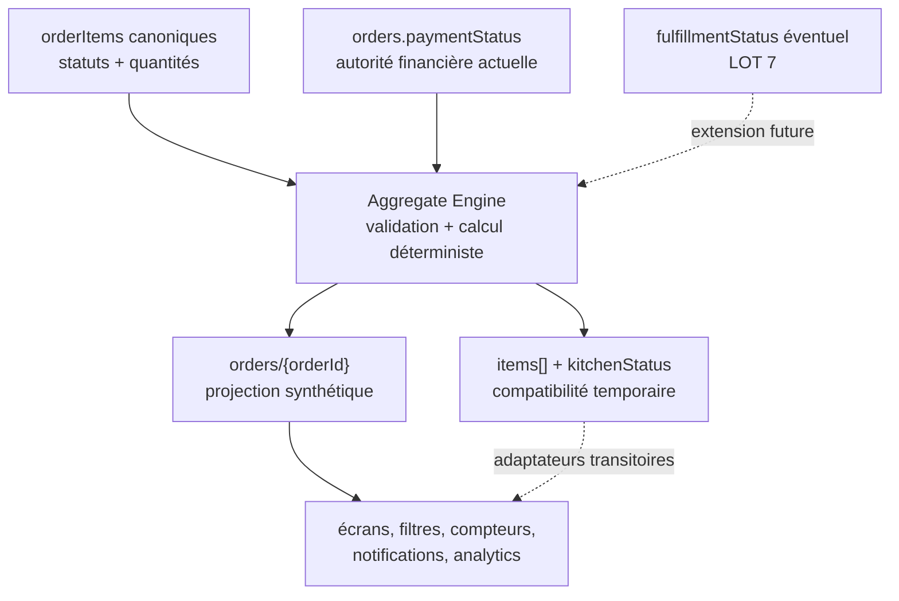
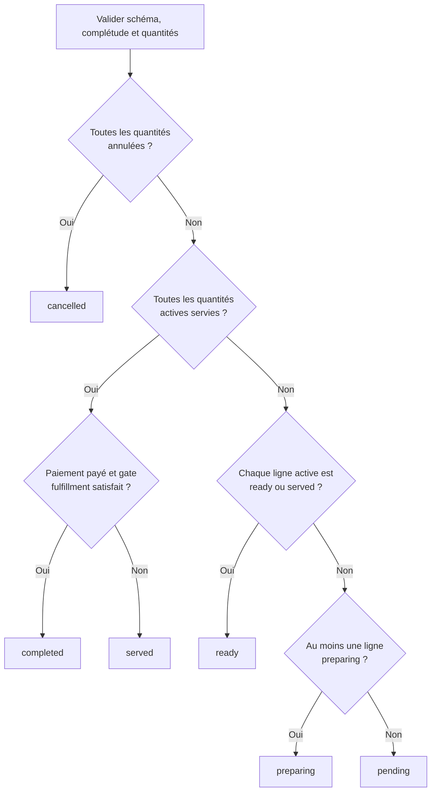
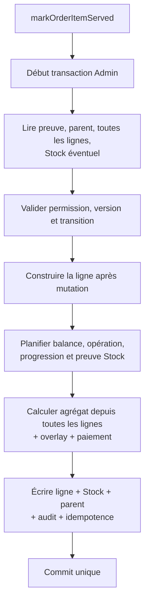

# LOT 3 — Design de l’agrégateur central des commandes Ordera

## 0. Statut et portée

| Élément | Décision |
|---|---|
| Nature | Conception préalable, aucune implémentation |
| Autorité opérationnelle | `orders/{orderId}/orderItems/{orderItemId}` |
| Projection synthétique | `orders/{orderId}` |
| Stratégie transactionnelle | Agrégation dans la transaction de la commande source |
| Compatibilité | `items[]` et `kitchenStatus` projetés temporairement |
| Legacy ambigu | Lecture seule, aucune réparation automatique |
| LOT 1 | Dérive l’agrégat initial avant son commit unique |
| LOT 2 | Produit les mutations canoniques de lignes et de paiement |
| LOT 3 | Recalcule le parent après chaque mutation canonique |

Ce document est normatif pour l’implémentation du LOT 3. Il complète les
spécifications, décisions, architectures et designs des LOT 1 et LOT 2.

## 1. Objectifs du lot

### 1.1 Pourquoi l’agrégateur est nécessaire

Le dépôt possède actuellement plusieurs décideurs concurrents :

- Cuisine traduit `kitchenStatus`, `status` ou `orderStatus`, modifie `items[]`
  puis choisit un nouvel état parent ;
- le POS groupe les commandes depuis une normalisation locale et peut écrire
  directement `kitchenStatus=served` et `orderStatus=served` ;
- plusieurs paiements modifient `paymentStatus` sans recalcul central ;
- le provider temps réel répare implicitement certains états ;
- les analytics et avis interprètent plusieurs aliases historiques ;
- la création publique marque encore certaines commandes directes
  `completed` alors qu’aucun service réel n’est établi.

Le résultat dépend donc du canal et parfois de l’ordre des clics. Un parent peut
rester `ready` après le service de toutes ses lignes, rester `served` après le
paiement, ou devenir `completed` à cause du paiement seul.

### 1.2 Pourquoi le LOT 2 ne décide pas seul du parent

Une commande LOT 2 ne possède qu’une intention locale :

- préparer une ligne ;
- rendre une ligne prête ;
- servir une quantité ;
- annuler une quantité ;
- confirmer un paiement.

Aucune de ces intentions ne peut décider isolément de l’état global sans lire
toutes les autres lignes et l’état financier. `markOrderItemServed()` ne doit
pas conclure que la commande est servie à partir de sa seule ligne.

Le LOT 3 ajoute donc un calcul commun appelé par les commandes LOT 2. Il
n’introduit pas de nouvelles transitions de lignes.

### 1.3 Ce que le LOT 3 centralise

- validation des données nécessaires à l’agrégation ;
- définition des quantités actives ;
- calcul pur et déterministe du statut global ;
- résumé quantitatif des lignes ;
- projection contrôlée du parent ;
- synchronisation temporaire de `items[]` ;
- version et concurrence de la projection ;
- audit du changement d’agrégat ;
- reconstruction administrative contrôlée ;
- tests unitaires et transactionnels.

### 1.4 Frontières avec les lots suivants

| Lot | Responsabilité réservée |
|---:|---|
| 3 | Calcul et projection du parent |
| 4 | Migration des actions et lectures Cuisine |
| 5 | Migration des actions et lectures POS |
| 6 | Intégration complète du paiement et des ledgers |
| 7 | Fulfillment Livraison |
| 8 | Retrait de `items[]` |
| 9 | Migration/interprétation des commandes historiques |
| 10 | Annulations, remboursements et compensations avancés |

Le LOT 3 n’introduit ni UI, ni paiement partiel, ni remboursement, ni état
logistique avancé.

## 2. Audit du code existant

### 2.1 Registre des mutations et dépendances

| Emplacement | Champ lu/écrit | Logique actuelle | Problème | Projection cible | Lot de migration |
|---|---|---|---|---|---:|
| `src/server/orders/create/builder.ts` | écrit `orderStatus`, `kitchenStatus`, `items[]` | `pending` si une ligne Cuisine, sinon `ready` | Correct uniquement pour l’état initial | Réutiliser `deriveInitialOrderAggregate` | 1, déjà fait |
| `src/services/orderService.ts` | écrit `kitchenStatus`, lit aliases | mutation globale historique | La commande globale remplace le cycle des lignes | Commandes LOT 2 + agrégateur | 4/5 |
| `src/services/order.service.ts` | écrit `kitchenStatus`, `orderStatus`, paiement | services historiques parallèles | Paiement et opération restent couplés | LOT 2 puis projection LOT 3 | 5/6 |
| `src/modules/kitchen/KitchenBoard.tsx` | écrit `items[].status`, `kitchenStatus`, historique | calcule le parent après un changement Cuisine | Cuisine peut décider du global et aller jusqu’à `served` | Lignes LOT 2, parent LOT 3 | 4 |
| `src/modules/kitchen/kitchen-view-model.tsx` | lit `kitchenStatus ?? status ?? orderStatus` | normalisation locale | Trois sources concurrentes | Lire `orderStatus`, adapter legacy séparément | 4 |
| `src/modules/orders/OrdersProvider.tsx` | requête `kitchenStatus`, répare `ready→served` | récupération et réparation temps réel | Une lecture possède un effet métier implicite | Requête `orderStatus`, aucune réparation | 4/5 |
| `src/app/(dashboard)/pos/components/POSClient.tsx` | écrit paiement, lignes, `kitchenStatus`, `orderStatus` | service direct et clôture POS | Le POS peut décider du parent | Commandes LOT 2 + LOT 3 | 5/6 |
| `src/app/(dashboard)/orders/components/OrdersClient.tsx` | écrit `paymentStatus` | validation paiement locale | Parent non recalculé après paiement | `confirmOrderPayment` + agrégateur | 6 |
| `src/components/orders/PaymentModal.tsx` | écrit `paymentStatus` | paiement cash/mobile direct | Plusieurs statuts et aucun agrégat commun | `confirmOrderPayment` | 6 |
| `src/services/pos-security.service.ts` | écrit paiement, `orderStatus`, tables/sessions | transaction de sécurité POS | Suppose un état parent fourni/local | Paiement LOT 2, projection LOT 3, tables LOT 6 | 6 |
| `src/app/r/[slug]/checkout/page.tsx` | crée `kitchenStatus/orderStatus=completed` pour direct | direct sans Cuisine considéré terminé | `ready` est confondu avec `served` | Création LOT 1 | migration public |
| `src/lib/order-lifecycle.ts` | lit `kitchenStatus ?? status ?? orderStatus` et `items[]` | normalisation générale legacy | Cache les divergences au lieu de les rendre visibles | Adaptateur legacy seulement | 4/5/8/9 |
| `src/utils/preparation-logic.ts` | lit `items[]` | détecte Cuisine et lignes non servies | Projection legacy utilisée comme autorité | Helpers sur `orderItems`/résumé parent | 4/5 |
| `src/services/analytics.service.ts` | lit état global normalisé | compte `served/completed` | Statistiques dépendantes d’aliases | Requête/lecture `orderStatus` | migration analytics |
| `src/components/OrderStepper.tsx` | lit `kitchenStatus/status` | progression client | Ignore l’autorité canonique | `orderStatus` projeté | migration client |
| `src/modules/kitchen/KitchenOrderCard.tsx` | calcule prochaine étape globale | transition de carte | Cycle parent utilisé comme cycle de ligne | Commandes par ligne LOT 2 | 4 |
| règles d’éligibilité avis | lit opération/paiement/fulfillment | accepte plusieurs états historiques | Nécessaire pour legacy, ambigu pour nouveau moteur | `orderStatus=completed` + adaptateur legacy | après LOT 3 |

### 2.2 Champs concurrents observés

| Champ | Situation actuelle | Décision cible |
|---|---|---|
| `orderStatus` | présent mais pas toujours autoritaire | **Statut canonique projeté du parent** |
| `status` | ancien statut polymorphe | Déprécié ; jamais écrit par LOT 3 |
| `kitchenStatus` | utilisé comme état global et filtre Cuisine | Projection temporaire de compatibilité |
| `paymentStatus` | multiples aliases | Autorité financière d’entrée, normalisée strictement |
| `preparationStatus` | variantes ponctuelles/historiques | Non canonique ; ne pas ajouter |
| `fulfillmentStatus` | livraison/récupération | Axe indépendant réservé au LOT 7 |
| `closureStatus` | pas d’autorité stable | Ne pas introduire au LOT 3 |
| `refundStatus` | axe financier futur | Entrée future, LOT 10 |

### 2.3 Filtres, compteurs et notifications affectés

- `OrdersProvider` filtre les commandes actives par `kitchenStatus` ;
- le POS regroupe ses colonnes depuis `getPOSOperationStatus()` ;
- Cuisine groupe depuis une normalisation de trois champs ;
- la page Commandes affiche et filtre via `getOrderStatus()` ;
- les analytics comptent `served` et `completed` ;
- l’éligibilité des avis dépend du statut opérationnel, du paiement et parfois
  du fulfillment ;
- les compteurs de commandes actives utilisent des aliases ;
- les notifications et stepper client interprètent `kitchenStatus/status`.

Ces consommateurs devront migrer dans leurs lots respectifs. Le LOT 3 rend
disponible une projection stable, mais ne les modifie pas.

## 3. Source de vérité



Règles absolues :

1. `orderItems` est l’autorité opérationnelle.
2. `orders` est une projection reconstruisible.
3. `items[]` n’est jamais une entrée lorsqu’au moins une ligne canonique existe.
4. `paymentStatus` est une entrée financière ; l’agrégateur ne le modifie pas.
5. Aucun écran ne calcule ou n’écrit le statut global.
6. Une commande partiellement canonique est ambiguë et doit être refusée.

## 4. États canoniques du parent

| État | Définition |
|---|---|
| `pending` | Aucune ligne en préparation et au moins une ligne active non prête |
| `preparing` | Au moins une ligne active est `preparing` |
| `ready` | Toutes les lignes actives sont `ready` ou déjà servies, mais toutes ne sont pas servies |
| `served` | Toutes les quantités actives sont servies, paiement non confirmé |
| `completed` | Toutes les quantités actives sont servies et paiement confirmé |
| `cancelled` | Toutes les quantités commandées sont annulées |

`completed` et `cancelled` sont terminaux pour le LOT 3. Les transitions
inverses nécessitent des commandes compensatoires du LOT 10.

`ready` est déterminé par les quantités et états des lignes, pas par une action
globale. Une ligne partiellement servie reste `ready`.

## 5. Définitions quantitatives et validation

Pour chaque ligne :

```text
activeQuantity    = quantity - cancelledQuantity
remainingToServe  = activeQuantity - servedQuantity

fullyServed       = activeQuantity > 0
                    AND servedQuantity == activeQuantity

fullyCancelled    = activeQuantity == 0
```

L’égalité est utilisée après validation. `>=` ne doit pas masquer un
dépassement.

### 5.1 Invariants obligatoires

```text
quantity est un entier strictement positif
servedQuantity est un entier >= 0
cancelledQuantity est un entier >= 0
cancelledQuantity <= quantity
servedQuantity <= activeQuantity
```

Compatibilité contrôlée :

- `cancelledQuantity` absent sur une ligne canonique LOT 1 : valeur `0`
  autorisée uniquement si `schemaVersion=1` ;
- `servedQuantity` absent : valeur `0` autorisée uniquement sur une ligne
  canonique non terminale explicitement identifiée ;
- `version` absent : fallback LOT 2 à `1`, sans effet sur les quantités ;
- une quantité négative ou non finie n’est jamais normalisée.

### 5.2 Cohérence état/quantités

| Situation | Résultat |
|---|---|
| `status=served` et quantité restante > 0 | `INVALID_ITEM_STATE` |
| quantité totalement servie et `status!=served` | `INVALID_ITEM_STATE` |
| `status=cancelled` et quantité active > 0 | `INVALID_ITEM_STATE` |
| quantité active = 0 et `status!=cancelled` | `INVALID_ITEM_STATE` |
| service partiel et `status=ready` | Valide |
| service partiel et `status=pending/preparing` | `INVALID_ITEM_STATE` |
| quantité servie > quantité active | `INCONSISTENT_QUANTITIES` |
| quantité annulée > quantité commandée | `INCONSISTENT_QUANTITIES` |

Le moteur échoue avant toute écriture. Il émet un log structuré de corruption
et laisse la commande inchangée.

## 6. Algorithme officiel d’agrégation

### 6.1 Entrées normalisées

- parent canonique ;
- liste complète des `orderItems` ;
- `paymentStatus` normalisé ;
- politique de fulfillment applicable ;
- overlay de la mutation courante avant commit.

### 6.2 Pseudo-algorithme

```text
aggregate(order, canonicalItems, pendingMutation, policy):
  assert order exists and belongs to restaurant
  assert canonicalItems is non-empty
  assert canonical set is complete and unambiguous

  effectiveItems = overlay(canonicalItems, pendingMutation)
  validate every effective item and its quantities

  summaries = map effectiveItems:
    activeQuantity   = quantity - cancelledQuantity
    remaining        = activeQuantity - servedQuantity
    fullyCancelled   = activeQuantity == 0
    fullyServed      = activeQuantity > 0 AND remaining == 0
    operationalState = validated item.status

  if every summary is fullyCancelled:
    nextStatus = cancelled
  else:
    active = summaries where NOT fullyCancelled

    if every active item is fullyServed:
      if paymentStatus is paid
         AND fulfillmentClosureGate(policy, order) is satisfied:
        nextStatus = completed
      else:
        nextStatus = served

    else if every active item is fullyServed OR status == ready:
      nextStatus = ready

    else if any active item has status == preparing:
      nextStatus = preparing

    else:
      nextStatus = pending

  projection = buildProjection(nextStatus, summaries, order)
  return projection plus warnings
```

La condition `ready` traite les lignes déjà servies comme ayant dépassé le
stade prêt. Ainsi, `served + ready` donne `ready`, tandis que `served + pending`
donne `pending`.

### 6.3 Priorité officielle



Cette priorité est indépendante de l’ordre des commandes concurrentes.

## 7. Table de vérité

| Lignes canoniques effectives | Paiement | Fulfillment LOT 3 | Parent | Notes |
|---|---|---|---|---|
| toutes `pending` | unpaid | N/A | `pending` | État initial Cuisine |
| `pending + ready` | unpaid | N/A | `pending` | Une ligne n’a pas commencé |
| `preparing + pending` | unpaid | N/A | `preparing` | Preparing prioritaire sur pending |
| `preparing + ready` | paid ou unpaid | N/A | `preparing` | Paiement sans effet opérationnel |
| toutes `ready` | unpaid | N/A | `ready` | Rien n’est servi |
| toutes `ready` | paid | N/A | `ready` | Paiement seul ne complète pas |
| `served + ready` | unpaid | N/A | `ready` | Commande partiellement remise |
| ligne partiellement servie `ready` | unpaid | N/A | `ready` | `servedQuantity < activeQuantity` |
| `served + pending` | unpaid | N/A | `pending` | Une ligne reste en attente |
| `served + preparing` | unpaid | N/A | `preparing` | Une ligne est en production |
| toutes actives `served` | unpaid | N/A | `served` | Paiement attendu |
| toutes actives `served` | pending | N/A | `served` | Paiement non confirmé |
| toutes actives `served` | failed | N/A | `served` | Nouvel encaissement possible |
| toutes actives `served` | paid | N/A | `completed` | Règle fondamentale |
| une annulée + autres `pending` | unpaid | N/A | `pending` | Ligne annulée exclue |
| une annulée + autres `ready` | unpaid | N/A | `ready` | Ligne annulée exclue |
| une annulée + autres `served` | unpaid | N/A | `served` | Ligne annulée exclue |
| une annulée + autres `served` | paid | N/A | `completed` | Seules les lignes actives comptent |
| ligne partiellement annulée et `ready` | unpaid | N/A | `ready` | Nouvelle quantité active |
| ligne partiellement annulée totalement servie | unpaid | N/A | `served` | Quantité active satisfaite |
| toutes annulées | unpaid/pending/failed | N/A | `cancelled` | Terminal |
| toutes annulées | paid | N/A | `cancelled` + anomalie | Remboursement requis, LOT 10 |
| toutes annulées | refunded | N/A | `cancelled` | État financier cohérent futur |
| toutes servies | refunded | N/A | `served` + anomalie | LOT 10 doit définir la compensation |
| Cuisine pending + Bar ready + direct ready | unpaid | N/A | `pending` | Commande mixte initiale |
| Cuisine preparing + Bar ready + direct served | paid | N/A | `preparing` | Paiement ne ferme rien |
| Cuisine ready + Bar ready + direct served | paid | N/A | `ready` | Tout est prêt/remis partiellement |
| Cuisine served + Bar served + direct served | paid | N/A | `completed` | Commande mixte terminée |
| aucune ligne canonique | quelconque | N/A | erreur | Legacy en lecture seule |
| lignes canoniques partielles | quelconque | N/A | erreur | Ambiguïté bloquante |

## 8. Scénario de commande mixte

Commande :

- 1 pizza Cuisine ;
- 2 Coca Bar ;
- 1 eau service direct.

| Étape | Pizza | Coca | Eau | Paiement | Parent |
|---:|---|---|---|---|---|
| Création | pending | ready | ready | unpaid | pending |
| Cuisine commence | preparing | ready | ready | unpaid | preparing |
| Eau remise | preparing | ready | served | unpaid | preparing |
| Pizza prête | ready | ready | served | unpaid | ready |
| 1 Coca remis | ready | ready (1/2) | served | unpaid | ready |
| Tout remis | served | served (2/2) | served | unpaid | served |
| Paiement confirmé | served | served | served | paid | completed |

```mermaid
sequenceDiagram
    participant Create as LOT 1
    participant Kitchen as Commandes Cuisine
    participant POS
    participant Items as orderItems
    participant Aggregate as LOT 3
    participant Parent as orders

    Create->>Items: pizza pending, Coca ready, eau ready
    Create->>Parent: orderStatus pending

    Kitchen->>Items: pizza preparing
    Kitchen->>Aggregate: trigger MarkOrderItemPreparing
    Aggregate->>Parent: preparing

    POS->>Items: eau served
    POS->>Aggregate: trigger MarkOrderItemServed
    Aggregate->>Parent: preparing

    Kitchen->>Items: pizza ready
    Kitchen->>Aggregate: trigger MarkOrderItemReady
    Aggregate->>Parent: ready

    POS->>Items: Coca servedQuantity 1/2
    POS->>Aggregate: trigger MarkOrderItemServed
    Aggregate->>Parent: ready

    POS->>Items: pizza served, Coca 2/2
    POS->>Aggregate: après chaque commande
    Aggregate->>Parent: served

    POS->>Aggregate: trigger ConfirmOrderPayment
    Aggregate->>Parent: completed
```

## 9. Interface du moteur

### 9.1 Calcul pur

```ts
computeOrderAggregate({
  order,
  items,
  overlay,
  fulfillmentPolicy,
}): ComputedOrderAggregate
```

Cette fonction :

- ne dépend pas de Firebase ;
- ne lit ni n’écrit ;
- valide et calcule ;
- produit une projection et des anomalies ;
- retourne toujours le même résultat pour les mêmes entrées.

### 9.2 Orchestration transactionnelle

```ts
recalculateOrderAggregate({
  restaurantId,
  orderId,
  trigger,
  actor,
  transaction,
  canonicalItems,
  overlay,
  expectedAggregateVersion?,
}): Promise<AggregateApplication>
```

Règles :

- `transaction` est obligatoire depuis une commande LOT 2 ;
- `trigger` est le nom de la commande source ;
- `actor` est repris de la commande source ;
- `expectedAggregateVersion` est utilisé par un rebuild autonome, pas exigé de
  l’UI pour une commande LOT 2 ;
- les lignes sont lues dans la transaction, avant toute écriture ;
- l’overlay représente l’état après de la ligne/paiement courant ;
- la fonction écrit uniquement la projection du parent ;
- elle ne modifie ni stock, ni paiement, ni ligne.

## 10. Stratégie transactionnelle retenue

### 10.1 Comparaison

| Option | Cohérence immédiate | Atomicité | Complexité/retry | Décision |
|---|---:|---:|---:|---|
| A. Même transaction | Oui | Complète | Lecture de toutes les lignes | **Retenue** |
| B. Juste après commit | Non | Deux commits | Parent temporairement obsolète | Rejetée |
| C. Événement asynchrone | Éventuelle | Non globale | Retry et observabilité supplémentaires | Rejetée |
| D. Hybride | Variable | Ambiguë | Deux autorités possibles | Rejetée |

### 10.2 Décision officielle

Toute commande LOT 2 appliquée calcule et écrit l’agrégat **dans sa transaction
Firestore Admin existante**.



Toutes les lectures doivent précéder toutes les écritures. Le store LOT 2 sera
adapté pour charger la collection complète `orderItems` dès qu’une commande
peut affecter l’agrégat.

Un échec de validation ou d’agrégation annule :

- la mutation de ligne ;
- la déduction Stock ;
- le paiement éventuel ;
- l’audit ;
- l’idempotence ;
- la projection parent.

Le parent ne peut donc jamais être obsolète après une commande LOT 2 réussie.

### 10.3 Concurrence

Deux commandes concurrentes lisant le même parent provoquent un retry
transactionnel. Au retry :

- les versions de lignes et paiement sont revérifiées par LOT 2 ;
- toutes les lignes sont relues ;
- l’agrégat est recalculé ;
- `aggregateVersion` courant est incrémenté seulement par le commit gagnant ;
- aucune projection calculée sur un snapshot ancien n’écrase la nouvelle.

## 11. Version du parent

Recommandation unique :

| Champ | Rôle |
|---|---|
| `aggregateVersion` | compteur entier dédié, initialisé à `1` au LOT 1 |
| `aggregateUpdatedAt` | timestamp serveur du dernier changement de projection |
| `aggregateSource` | `LOT1_CREATE`, commande LOT 2 ou `ADMIN_REBUILD` |
| `aggregateReason` | raison stable, non localisée |
| `updatedAt` | compatibilité des listeners globaux |

Ne pas utiliser un champ générique `version` : la version du paiement et les
versions des lignes possèdent déjà leurs propres axes.

Si la projection calculée est strictement identique :

- ne pas incrémenter `aggregateVersion` ;
- ne pas modifier `aggregateUpdatedAt` ;
- ne pas produire d’audit d’agrégat ;
- la mutation source reste néanmoins appliquée et auditée si elle a changé sa
  propre autorité.

## 12. Projection du parent

### 12.1 Champs retenus

| Champ | Type | Justification |
|---|---|---|
| `orderStatus` | enum canonique | Filtres et affichage global |
| `kitchenStatus` | enum compatible | Transition LOT 4/5 uniquement |
| `orderAggregate` | objet versionné | Résumé explicable et compteurs communs |
| `aggregateVersion` | entier | Concurrence et diagnostic |
| `aggregateUpdatedAt` | timestamp | Fraîcheur |
| `aggregateSource` | chaîne | Observabilité |
| `aggregateReason` | chaîne | Explication |
| `items[]` | projection temporaire | Compatibilité jusqu’au LOT 8 |

`orderAggregate` contient uniquement :

```text
schemaVersion
activeItemCount
pendingItemCount
preparingItemCount
readyItemCount
servedItemCount
cancelledItemCount
allActiveItemsServed
hasKitchenItems
hasBarItems
hasDirectItems
```

Les compteurs sont des compteurs de **lignes**, pas de quantités. Les quantités
restent dans `orderItems`.

### 12.2 Champs non retenus

- pas de duplication `status` ;
- pas de `preparationStatus` ;
- pas de `closureStatus` au LOT 3 ;
- pas de total financier recalculé ;
- pas de `refundStatus` inventé ;
- pas de compteurs par produit ou catégorie.

### 12.3 Projection temporaire `items[]`

Si une correspondance bijective par `orderItemId/id` existe, le LOT 3 remplace
uniquement dans chaque entrée :

- `status` ;
- `servedQuantity` ;
- `cancelledQuantity` ;
- `version` ;
- timestamps/acteurs de transition déjà présents sur la ligne.

Les snapshots de nom, prix et options sont conservés. Aucun élément n’est
ajouté ou supprimé silencieusement. Une absence, un doublon ou un ID ambigu
produit `LEGACY_PROJECTION_AMBIGUOUS` pour une commande qui exige encore cette
compatibilité.

`kitchenStatus` reflète temporairement `orderStatus` avec le vocabulaire
compatible existant. Il cesse d’être une autorité.

## 13. Compatibilité legacy

| Forme observée | Politique |
|---|---|
| `orderItems` complets, `items[]` cohérent | Agrégation canonique et projection |
| `orderItems` complets, aucun `items[]` | Agrégation canonique sans projection legacy |
| quelques `orderItems` + davantage d’entrées `items[]` | Refus, `LEGACY_ORDER_READ_ONLY` |
| uniquement `items[]` | Lecture seule, `NO_CANONICAL_ORDER_ITEMS` |
| commande historique déjà terminale sans lignes | Ne rien écrire ; adaptateur de lecture |
| IDs dupliqués dans `items[]` | Refus, ambiguïté |
| aliases historiques dans une ligne canonique | Refus ; aliases acceptés seulement par adaptateur legacy |
| champs quantitatifs absents et origine indéterminable | Refus |

Le moteur ne fabrique jamais des `orderItems` depuis `items[]`. Cette opération
appartiendrait à une migration explicite du LOT 9.

Pour les écrans historiques, `src/lib/order-lifecycle.ts` peut rester un
adaptateur de lecture, mais il ne doit jamais alimenter une écriture canonique.

## 14. Annulations

### 14.1 Ligne partiellement annulée

La quantité active diminue. L’état global est recalculé depuis cette nouvelle
quantité. Si toute la quantité active restante est déjà servie, la ligne compte
comme servie.

### 14.2 Ligne totalement annulée

Elle est exclue de la préparation et du service, mais incluse dans
`cancelledItemCount`.

### 14.3 Toutes les lignes annulées

Le parent devient `cancelled`, indépendamment du paiement. Si le paiement est
`paid`, l’agrégateur :

- ne rembourse rien ;
- ne change pas `paymentStatus` ;
- émet l’anomalie `PAID_CANCELLED_REFUND_REQUIRED` dans le résultat et l’audit ;
- laisse le LOT 10 créer le remboursement.

### 14.4 Compensation après service

Une compensation de stock ou financière est un événement séparé. Elle ne
réécrit pas rétroactivement `servedQuantity`. Son impact futur sur la clôture
sera défini au LOT 10.

## 15. Paiement

### 15.1 Normalisation d’entrée

| Valeurs | Classe agrégée |
|---|---|
| `paid`, alias legacy vérifié | `paid` |
| `unpaid` | `unpaid` |
| `pending`, `pending_cash`, `pending_mobile`, `pending_verification` | `pending` |
| `failed`, `voided` | `failed` |
| `refunded` | `refunded` futur |
| `partially_refunded` | `partially_refunded` futur |
| valeur inconnue sur commande canonique | `PAYMENT_STATE_INCONSISTENT` |

Les aliases sont acceptés uniquement à une frontière explicitement legacy. Les
nouvelles commandes écrivent les valeurs canoniques.

### 15.2 Effet

- `paid` n’accélère jamais `pending`, `preparing` ou `ready` ;
- toutes les lignes servies + `unpaid/pending/failed` donnent `served` ;
- toutes les lignes servies + `paid` donnent `completed` ;
- un paiement remboursé ne rouvre pas automatiquement une commande ;
- une incohérence refund/service est signalée et réservée au LOT 10.

L’agrégateur lit le paiement. Il ne crée, confirme, annule ou rembourse aucun
paiement.

## 16. Livraison et fulfillment

Recommandation compatible LOT 7 :

- `orderStatus` reste l’axe commercial global ;
- `fulfillmentStatus` devient un axe logistique distinct ;
- le service d’une livraison signifie la remise au livreur et déclenche le
  Stock une seule fois ;
- le LOT 7 introduit une politique
  `completionRequiresDeliveryConfirmation=true` ;
- avec cette politique, lignes servies + paiement payé donnent `served` tant
  que `fulfillmentStatus != delivery_confirmed` ;
- après confirmation de livraison, l’agrégateur donne `completed` sans nouvelle
  déduction.

Le LOT 3 prépare le port `fulfillmentClosureGate`, mais la politique reste
désactivée tant que le LOT 7 n’est pas implémenté. Aucun état de livraison
n’est inventé maintenant.

## 17. Erreurs et anomalies

| Code | Niveau | Bloquant | Comportement | Audit |
|---|---|---:|---|---|
| `ORDER_NOT_FOUND` | ERROR | Oui | rollback | log de refus |
| `NO_CANONICAL_ORDER_ITEMS` | ERROR | Oui | legacy lecture seule | log diagnostic |
| `INCONSISTENT_QUANTITIES` | CRITICAL | Oui | rollback, aucune normalisation | log sécurité/donnée |
| `INVALID_ITEM_STATE` | ERROR | Oui | rollback | log diagnostic |
| `AGGREGATE_CONFLICT` | ERROR | Oui | retry/relecture puis refus | log opérationnel |
| `CONCURRENT_MODIFICATION` | WARNING | Oui | retry après refresh | audit LOT 2 du refus |
| `LEGACY_ORDER_READ_ONLY` | WARNING | Oui pour mutation | aucune réparation | log diagnostic |
| `LEGACY_PROJECTION_AMBIGUOUS` | ERROR | Oui | rollback | log diagnostic |
| `PAYMENT_STATE_INCONSISTENT` | ERROR | Oui si valeur inconnue | rollback | log financier |
| `PAID_CANCELLED_REFUND_REQUIRED` | WARNING | Non | projeter `cancelled` | audit agrégat |
| `REFUND_STATE_REQUIRES_LOT10` | WARNING | Non/selon cas | conserver état explicable | audit agrégat |

Un refus transactionnel ne peut pas avoir un audit Firestore dans le commit
annulé. Il produit un log structuré corrélé à la commande source.

## 18. Audit de l’agrégation

### 18.1 Commande LOT 2

Ne pas créer un second document d’audit. Le document `commandAudit` de la
commande source reçoit une section :

```text
aggregate:
  changed
  before
  after
  versionBefore
  versionAfter
  trigger
  reason
  warnings
```

Si `changed=false`, aucune section volumineuse avant/après n’est ajoutée et
aucun audit autonome n’est créé.

### 18.2 Rebuild autonome

Un rebuild qui change la projection crée un `commandAudit` avec
`commandName=RebuildOrderAggregate`. Un rebuild sans changement ne crée aucun
audit métier ; il retourne `NO_CHANGE` et produit seulement une métrique.

Ainsi, le modèle LOT 2 reste l’unique journal de commandes.

## 19. Idempotence

- dans une commande LOT 2, l’agrégateur repose sur la preuve
  `orderCommandIdempotency` de la commande source ;
- il ne crée aucune preuve supplémentaire ;
- le replay retourne la réponse persistée sans recalcul dangereux ;
- le calcul pur est naturellement idempotent ;
- `aggregateVersion` empêche l’écrasement par un rebuild obsolète ;
- `rebuildOrderAggregate` utilise le même moteur d’idempotence commun avec son
  propre `commandName`, jamais une troisième collection.

## 20. Rebuild administratif

### 20.1 Contrat proposé

```ts
rebuildOrderAggregate({
  restaurantId,
  orderId,
  actor,
  reason,
  expectedAggregateVersion,
  idempotencyKey,
  dryRun,
})
```

### 20.2 Permissions et garanties

- Manager/Owner avec capacité support explicite ;
- acteur système de maintenance contrôlé ;
- restaurant strictement vérifié ;
- lecture complète des lignes canoniques ;
- refus des commandes legacy ambiguës ;
- `dryRun=true` par défaut pour les outils support ;
- audit obligatoire si écriture ;
- aucun effet sur lignes, paiement ou stock ;
- transaction Admin autonome ;
- pas d’endpoint public dans le LOT 3 initial.

La primitive serveur est utile au diagnostic. Son exposition UI/HTTP est
reportée et nécessite une autorisation séparée.

## 21. Performances

### 21.1 Coût

Le LOT 1 limite une commande à 50 lignes. Une agrégation lit :

- un parent ;
- jusqu’à 50 petits documents `orderItems` ;
- les documents spécifiques de la commande LOT 2, déjà nécessaires.

Aucune pagination n’est pertinente dans une transaction portant sur un agrégat
complet. Une requête directe de sous-collection ne nécessite pas d’index
composite.

### 21.2 Contentions

Toutes les mutations d’une même commande touchent le même parent. Firestore les
sérialise par retry transactionnel. Cette contention est souhaitée : deux
états globaux concurrents ne doivent pas être validés indépendamment.

Les restaurants et commandes distincts ne partagent aucun document ; la montée
en charge multi-tenant reste horizontale.

### 21.3 Conclusion

Lire au maximum 50 lignes à chaque mutation est acceptable pour le LOT 3 :

- borne stricte et faible ;
- priorité à la cohérence ;
- documents de lignes petits ;
- aucune lecture N+1 distante hors transaction ;
- simplicité supérieure à des compteurs incrémentaux difficiles à réparer.

Le pire cas d’une commande de 50 lignes servies une par une produit beaucoup de
lectures. Il doit être mesuré. Une optimisation future pourra regrouper une
action multi-lignes dans une commande atomique, mais ne devra pas introduire de
compteurs comme nouvelle autorité.

## 22. Matrice des tests

### 22.1 Calcul pur

| Cas | Attendu |
|---|---|
| toutes pending | `pending` |
| une preparing | `preparing` |
| toutes ready | `ready` |
| service partiel | `ready` |
| served + pending | `pending` |
| served + preparing | `preparing` |
| served + ready | `ready` |
| toutes served non payées | `served` |
| toutes served payées | `completed` |
| paiement avant service | état opérationnel inchangé |
| toutes annulées | `cancelled` |
| annulée + servie | `served/completed` selon paiement |
| annulation partielle | quantité active exacte |
| Cuisine + Bar + direct | séquence de la section 8 |
| commande vide | `NO_CANONICAL_ORDER_ITEMS` |
| quantité incohérente | `INCONSISTENT_QUANTITIES` |
| état incompatible | `INVALID_ITEM_STATE` |
| paiement inconnu | `PAYMENT_STATE_INCONSISTENT` |
| résultat identique | `changed=false` |

### 22.2 Projection

- compteurs exacts ;
- modes présents exacts ;
- `orderStatus` et compatibilité `kitchenStatus` ;
- `status` legacy jamais écrit ;
- `items[]` mis à jour par ID stable seulement ;
- noms/prix/options legacy conservés ;
- doublon ou ligne manquante refusé ;
- version incrémentée uniquement si projection changée ;
- timestamps et raisons serveur.

### 22.3 Transactions émulateur

- `preparing` : ligne + parent + audit + preuve, commit unique ;
- `ready` : parent immédiatement cohérent ;
- `served` : ligne + Stock + parent + audits + preuves atomiques ;
- paiement : `served→completed` dans le même commit ;
- annulation totale : parent `cancelled` ;
- erreur Stock : aucun changement parent ;
- erreur agrégat : aucun changement ligne/Stock/paiement ;
- deux services concurrents ;
- service et paiement concurrents ;
- conflit `aggregateVersion` sur rebuild ;
- replay : aucune nouvelle version/audit ;
- projection identique : aucune écriture d’agrégat ;
- rollback complet.

### 22.4 Legacy et non-régression

- uniquement `items[]` : lecture seule ;
- sous-collection partielle : refus ;
- commande historique terminale : aucune réparation ;
- LOT 1 conserve son agrégat initial ;
- toutes les commandes LOT 2 restent idempotentes ;
- Stock V2 déduit une seule fois ;
- paiement ne déduit rien ;
- parent ne devient pas `completed` avant service total ;
- suites LOT 1, LOT 2, Stock, analytics et réputation.

## 23. Architecture des modules

```text
src/server/orders/
  aggregate/
    types.ts
    policies.ts
    validation.ts
    compute.ts
    projection.ts
    compatibility.ts
    errors.ts
    audit.ts
    service.ts
    rebuild.ts
    index.ts

  commands/
    firestore-store.ts       # orchestration transactionnelle partagée
    transitions.ts           # overlay LOT 2

  common/
    idempotency.ts
```

Le calcul reste séparé du store. `firestore-store.ts` ne recalcule aucune règle
parallèle ; il charge, appelle `compute`, puis applique la projection.

## 24. Éléments à réutiliser

| Élément | Usage LOT 3 |
|---|---|
| `src/server/orders/create/types.ts` | schéma parent et lignes LOT 1 |
| `src/server/orders/create/builder.ts` | aligner la dérivation initiale |
| `src/server/orders/commands/types.ts` | états, acteur, trigger et résultat |
| `src/server/orders/commands/transitions.ts` | construire l’overlay après mutation |
| `src/server/orders/commands/firestore-store.ts` | transaction Admin commune |
| `src/server/orders/commands/errors.ts` | hiérarchie d’erreurs à étendre |
| `src/server/orders/common/idempotency.ts` | preuve commune et rebuild |
| `commandAudit` LOT 2 | audit enrichi, sans seconde collection |
| `src/lib/order-lifecycle.ts` | inventaire des aliases, lecture legacy seulement |
| `src/utils/preparation-logic.ts` | connaissance des modes à déplacer en helper pur |
| helpers de préparation LOT 1 | `preparationMode` canonique |

Le LOT 1 devra appeler le même calcul pur, ou au minimum un wrapper
`deriveInitialOrderAggregate` testé contre le moteur LOT 3, afin d’empêcher une
divergence création/mutation.

## 25. Éléments à déprécier dans les lots futurs

- `updateOrderStatus()` dans les deux services historiques ;
- calcul parent dans `KitchenBoard` ;
- service/réparation automatique dans `OrdersProvider` ;
- écritures globales du POS ;
- paiements directs dans `OrdersClient` et `PaymentModal` ;
- couplage paiement/état/table de `pos-security.service` ;
- création publique directe marquée `completed` ;
- `getOrderStatus()` utilisé comme autorité d’écriture ;
- agrégats calculés uniquement depuis `items[]` ;
- requêtes actives sur `kitchenStatus` ;
- le champ polymorphe `status` du parent ;
- l’usage de `kitchenStatus` comme statut commercial.

Rien n’est supprimé pendant le LOT 3 de conception ou d’implémentation initiale.

## 26. Risques techniques

| Risque | Niveau | Réponse |
|---|---|---|
| Store LOT 2 ne lit pas encore toutes les lignes pour chaque commande | Critique | Refactor transactionnel LOT 3 |
| `items[]` et sous-collection non bijectifs | Critique | Refus explicite, pas de réparation |
| anciens écrans écrivent encore le parent | Critique | Migrations LOT 4/5/6 avant activation |
| `kitchenStatus` utilisé dans les requêtes | Élevé | Projection temporaire cohérente |
| commandes directes publiques `completed` | Élevé | Migrer vers LOT 1 |
| aliases paiement nombreux | Élevé | Normalisation à la frontière, valeurs canoniques strictes |
| contention parent | Moyen | Retry + versions ; borne 50 |
| coût jusqu’à 50 lectures par mutation | Moyen | Mesure, commandes groupées futures |
| avis/analytics sur aliases | Moyen | Migration après projection stable |
| livraison future | Moyen | Gate de fulfillment extensible |
| paid + cancelled legacy | Moyen | Anomalie et LOT 10 |
| agrégat identique mais mutation de ligne | Faible | Pas de version/audit agrégat supplémentaire |

## 27. Décisions ouvertes et recommandations uniques

### 27.1 Toutes les lignes annulées après paiement

**Recommandation :** projeter `cancelled`, conserver `paymentStatus=paid`,
signaler `PAID_CANCELLED_REFUND_REQUIRED`, laisser le remboursement au LOT 10.

### 27.2 `kitchenStatus`

**Recommandation :** le maintenir comme projection compatible de
`orderStatus` jusqu’aux LOT 4/5, puis le réserver ou le supprimer au LOT 8/9.

### 27.3 `items[]`

**Recommandation :** synchronisation uniquement si la bijection des IDs est
prouvée ; sinon rollback. Aucun merge heuristique.

### 27.4 Agrégation dans ou après la transaction

**Recommandation :** exclusivement dans la transaction source. Aucun événement
asynchrone de rattrapage comme chemin normal.

### 27.5 Projection identique

**Recommandation :** aucune écriture, aucune version et aucun audit agrégat.

### 27.6 Version

**Recommandation :** `aggregateVersion` dédié ; ne pas surcharger `version`.

### 27.7 Livraison

**Recommandation :** axe `fulfillmentStatus` séparé et gate de clôture activé
au LOT 7 ; aucune seconde déduction à `delivery_confirmed`.

### 27.8 Rebuild

**Recommandation :** primitive serveur implémentée avec le LOT 3, mais aucune
route/UI tant qu’un besoin support autorisé n’est pas validé.

### 27.9 Performance

**Recommandation :** lire toutes les lignes jusqu’à 50. Ne pas introduire de
compteurs incrémentaux comme autorité.

## 28. Critères GO / NO-GO

### 28.1 GO pour implémenter

- algorithme et invariants validés ;
- priorité `cancelled → served/completed → ready → preparing → pending` validée ;
- stratégie transactionnelle unique acceptée ;
- projection minimale acceptée ;
- compatibilité `items[]` par bijection acceptée ;
- `aggregateVersion` accepté ;
- paid + cancelled et future Livraison décidés ;
- matrices de vérité et tests validées.

### 28.2 GO pour considérer le LOT 3 terminé

- calcul pur partagé avec l’état initial LOT 1 ;
- toutes les commandes LOT 2 agrègent dans leur transaction ;
- parent jamais obsolète après un commit réussi ;
- rollback ligne/Stock/paiement/parent démontré ;
- concurrence service/paiement démontrée ;
- legacy ambigu refusé ;
- aucune UI raccordée prématurément ;
- tests unitaires, émulateur, LOT 1, LOT 2 et Stock verts.

### 28.3 NO-GO

- calcul après commit ;
- Cloud Function comme chemin normal ;
- parent calculé depuis `items[]` lorsqu’une sous-collection existe ;
- réparation automatique d’une commande partielle ;
- paiement seul donnant `completed` ;
- Cuisine donnant `served` ;
- version incrémentée sur un no-op ;
- troisième mécanisme d’idempotence ou d’audit ;
- livraison provoquant une seconde déduction ;
- écran calculant son propre statut.

## 29. Conclusion

Le moteur cible suit une séquence unique :

```text
intention LOT 2
→ lecture du parent et de toutes les lignes
→ validation de la transition et des quantités
→ overlay de la mutation
→ effets Stock/paiement éventuels
→ calcul pur de l’agrégat
→ projection parent + audit + idempotence
→ commit atomique
```

La formule commerciale reste :

```text
toutes les quantités actives servies
+ paiement confirmé
+ gate de fulfillment éventuel satisfait
= completed
```

Le parent devient une projection explicable, versionnée et reconstruisible. Il
ne dépend plus du canal, de l’ordre des clics ou d’un calcul local d’écran.
