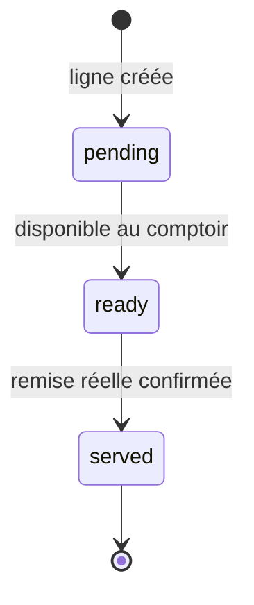
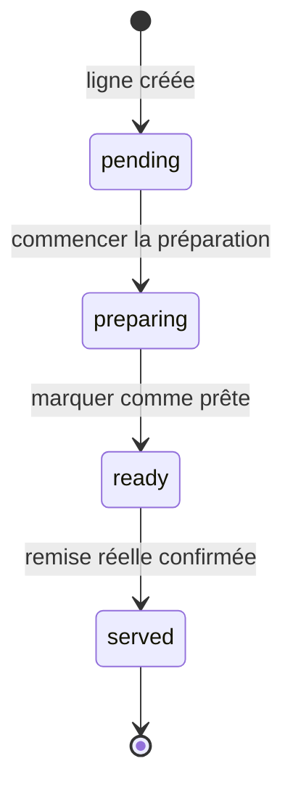
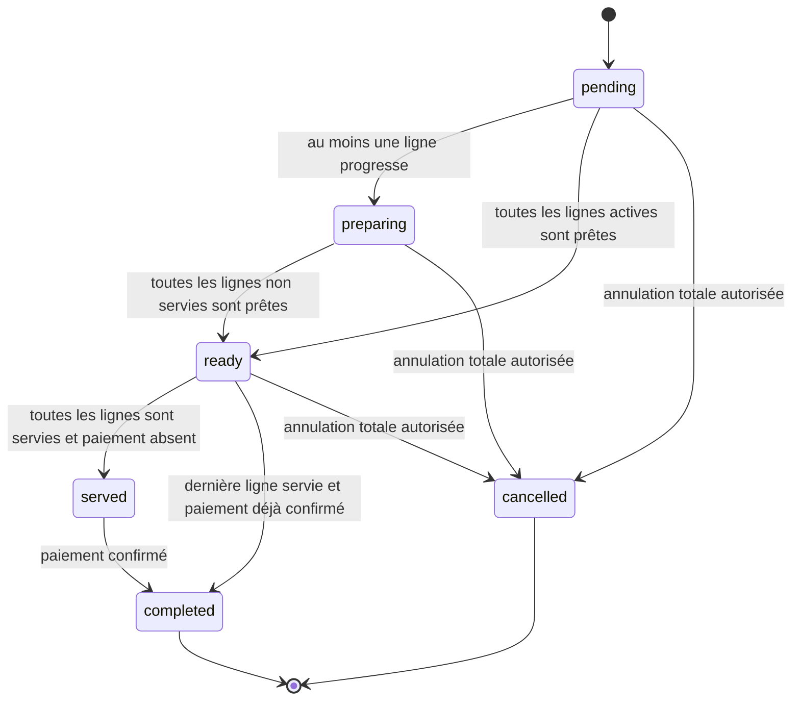
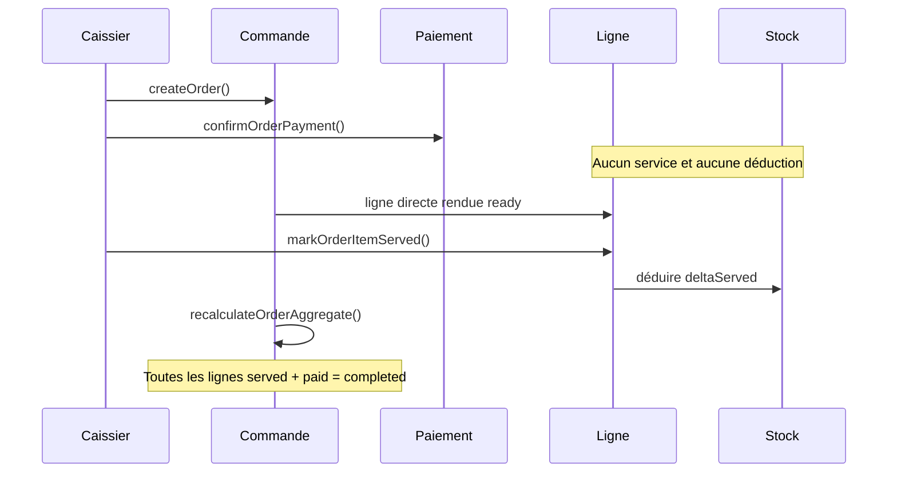
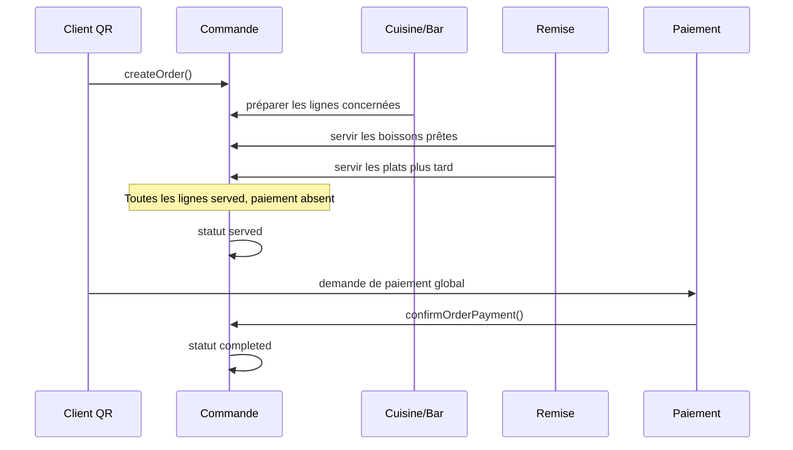
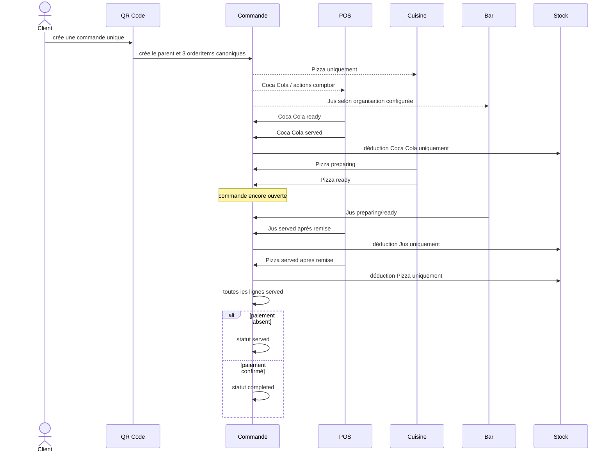
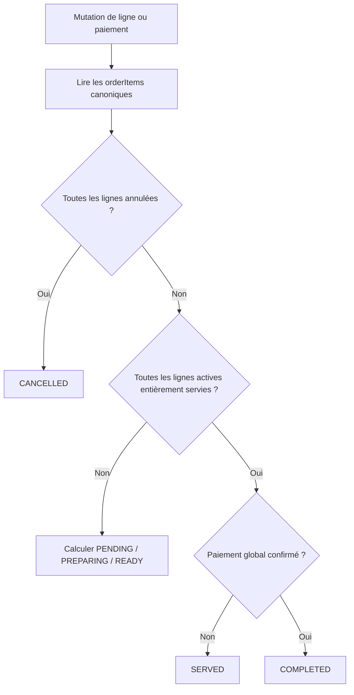

# Cahier des charges du moteur métier des commandes Ordera

| Propriété | Valeur |
| --- | --- |
| Statut du document | Spécification métier normative |
| Portée | POS, QR Code, Cuisine, Bar, Salle, emporté et livraison |
| Unité opérationnelle | Ligne de commande canonique |
| Unité commerciale et financière | Commande |
| Version | 1.0 |
| Langue de référence | Français |

> Ce document est la référence métier obligatoire avant toute modification d'un
> parcours de commande Ordera. Les termes **DOIT**, **NE DOIT PAS**, **PEUT** et
> **DEVRAIT** expriment respectivement une obligation, une interdiction, une
> possibilité et une recommandation.

## 1. Contexte

Ordera accepte des commandes provenant de plusieurs canaux :

- vente créée au POS avec le caissier ;
- commande créée par le client après scan du QR Code à table ;
- commande publique à emporter ;
- commande publique en livraison.

Historiquement, ces canaux n'ont pas toujours créé les mêmes documents, les
mêmes identifiants de ligne ni les mêmes statuts. Certaines interfaces ont
également utilisé le statut global de la commande comme substitut au statut de
chaque ligne.

Le moteur cible repose sur les invariants suivants :

1. la ligne est l'unité de production et de service ;
2. la commande est l'unité commerciale, client et financière ;
3. chaque ligne avance indépendamment des autres ;
4. le paiement est indépendant de la production et du service ;
5. le stock est déduit uniquement pour la quantité réellement servie ;
6. la commande globale est une projection déterministe de ses lignes et de son
   paiement ;
7. tous les canaux créent le même modèle de lignes canoniques.

Ce cahier des charges ne prescrit aucune migration destructive des données
historiques. Il décrit le modèle officiel que toute évolution doit respecter.

## 2. Principes métier officiels

### 2.1 Principe central

Une commande regroupe une ou plusieurs lignes et porte une addition unique.
Elle ne pilote pas directement la production de toutes les lignes.

Exemple :

```text
Commande client
├── 2 Coca Cola — Service direct
├── 1 Pizza — Cuisine
└── 1 Jus — Bar
```

Les trois lignes peuvent être préparées, rendues prêtes et servies à des
moments différents. Le client règle néanmoins une seule addition globale pour
la commande.

### 2.2 Invariants non négociables

- Une commande **NE DOIT JAMAIS** être créée directement en `completed`.
- Chaque canal **DOIT** créer des `orderItems` canoniques.
- Un même `orderItemId` **DOIT** identifier la ligne dans tous les traitements
  et toutes les projections compatibles.
- Un écran **NE DOIT PAS** modifier directement un statut métier.
- Une transition **DOIT** passer par une commande métier autorisée.
- Le paiement **NE DOIT JAMAIS** servir implicitement une ligne.
- Le paiement **NE DOIT JAMAIS** déduire le stock.
- `ready` signifie prêt à être remis, pas déjà remis.
- `served` signifie qu'une quantité a réellement été remise au client.
- `completed` signifie que toutes les lignes actives sont servies et que le
  paiement global est confirmé.
- Le résultat agrégé **DOIT** être indépendant de l'ordre d'exécution des
  actions venant du POS, de la Cuisine ou d'un autre écran.

## 3. Acteurs réels

### 3.1 Client

Le client peut :

- commander au POS par l'intermédiaire du caissier ;
- créer lui-même sa commande en scannant un QR Code à table ;
- créer une commande publique à emporter ;
- créer une commande publique en livraison ;
- suivre l'avancement qui lui est exposé ;
- demander ou effectuer un paiement selon le canal.

Le client QR **NE PEUT PAS** :

- marquer une ligne servie ;
- modifier un stock ;
- terminer lui-même une commande.

### 3.2 Serveur

Le serveur **NE PREND PAS** les commandes dans Ordera.

Ordera ne doit pas être conçu comme un système traditionnel où le serveur
saisit toutes les commandes. Son rôle opérationnel réel est :

- assister verbalement le client ;
- aider le client à scanner le QR Code ;
- transporter les boissons et les plats ;
- remettre physiquement les produits ;
- signaler au personnel autorisé que la ligne a réellement été servie.

Le présent document n'impose ni poste complet de prise de commande Serveur, ni
nouveau moteur de saisie pour ce rôle.

Le serveur remet physiquement les produits, puis informe verbalement le
caissier ou un autre membre du personnel déjà autorisé. Ce personnel confirme
ensuite le service dans Ordera, notamment depuis la vue Commandes du POS. La
confirmation doit rester possible ligne par ligne afin de représenter
fidèlement les services successifs d'une commande à table.

Aucun nouveau compte Serveur, aucune application Serveur et aucun tableau de
bord Serveur ne sont obligatoires pour appliquer ce fonctionnement.

### 3.3 Caissier

Le caissier :

- crée les ventes POS ;
- encaisse ;
- voit les commandes qui nécessitent une action au comptoir ;
- voit notamment les lignes en Service direct ;
- coordonne la remise avec le serveur ;
- confirme dans l'application que la ligne a réellement été servie.

Le caissier **NE DOIT PAS** :

- préparer une ligne Cuisine ;
- servir automatiquement une ligne lors du paiement.

### 3.4 Cuisine

La Cuisine :

- voit uniquement les lignes `preparationMode = kitchen` ;
- démarre leur préparation ;
- les marque prêtes.

Son cycle normal s'arrête à `ready`. La Cuisine **NE DOIT PAS** représenter
automatiquement la remise physique au client.

Dans le périmètre actuel, la Cuisine s'arrête obligatoirement à `ready`.
Aucune configuration de remise depuis la Cuisine n'est créée.

### 3.5 Bar

Le Bar constitue un mode métier distinct, même si aucun poste Bar autonome
n'est encore déployé.

Dans le périmètre actuel, le POS gère les lignes
`preparationMode = bar`. Aucun poste Bar autonome n'est créé. Cette règle
n'empêche pas une future interface Bar d'utiliser le même moteur métier.

### 3.6 Livreur

Le livreur **N'A PAS DE COMPTE ORDERA**.

Il récupère physiquement la commande, reçoit les informations nécessaires et
effectue la livraison. Le suivi applicatif reste sous la responsabilité du
personnel autorisé du restaurant.

Ce cahier des charges n'introduit :

- aucun portail Livreur ;
- aucune authentification Livreur ;
- aucun rôle Livreur obligatoire ;
- aucun suivi GPS obligatoire.

### 3.7 Manager

Le manager :

- supervise les commandes ;
- consulte les incohérences et l'historique ;
- peut corriger exceptionnellement une situation selon ses permissions.

Le manager **NE DOIT PAS** remplacer le parcours opérationnel normal.

## 4. Modèle canonique d'une ligne

### 4.1 Chemin de référence

```text
restaurants/{restaurantId}/orders/{orderId}/orderItems/{orderItemId}
```

Le document de ligne est l'autorité pour :

- son statut ;
- sa progression ;
- la quantité servie ;
- les acteurs et timestamps de préparation et de service ;
- son mode de préparation.

### 4.2 Champs minimaux

| Champ | Type métier | Obligatoire | Règle |
| --- | --- | --- | --- |
| `orderItemId` | chaîne | oui | Stable et unique dans la commande |
| `orderId` | chaîne | oui | Référence au parent |
| `restaurantId` | chaîne | oui | Tenant propriétaire |
| `productId` | chaîne | oui | Produit vendu |
| `productName` | chaîne | oui | Snapshot du nom lors de la vente |
| `quantity` | nombre positif | oui | Quantité commandée |
| `servedQuantity` | nombre positif ou nul | oui | `0 <= servedQuantity <= quantity` |
| `preparationMode` | enum | oui | `direct`, `kitchen` ou `bar` |
| `status` | enum | oui | `pending`, `preparing`, `ready`, `served` |
| `readyAt` | date ou null | oui | Renseigné au premier passage à `ready` |
| `preparedBy` | identifiant ou null | oui | Acteur ayant confirmé la préparation |
| `servedAt` | date ou null | oui | Renseigné lorsque la ligne est entièrement servie |
| `servedBy` | identifiant ou null | oui | Acteur ayant confirmé le service |
| `unitPrice` | montant | oui | Prix unitaire figé à la vente |
| `totalPrice` | montant | oui | Montant commercial de la ligne |
| `createdAt` | date | oui | Immuable |
| `updatedAt` | date | oui | Dernière mutation métier |

Des snapshots complémentaires peuvent conserver variantes, options, taxes,
remises et notes. Ils ne modifient pas le cycle canonique.

### 4.3 Invariants de quantité

```text
quantity > 0
0 <= servedQuantity <= quantity
totalPrice = règle commerciale appliquée à la ligne
```

Une ligne est entièrement servie lorsque :

```text
servedQuantity = quantity
```

Une progression partielle est autorisée :

```text
0 < servedQuantity < quantity
```

Dans ce cas :

- le stock est déduit uniquement du delta nouvellement servi ;
- la ligne conserve `status = ready` ;
- l'interface affiche « Partiellement servie — X sur Y » ;
- le client voit qu'une partie de la ligne a été servie ;
- le passage à `served` intervient uniquement lorsque
  `servedQuantity = quantity`.

### 4.4 Cycle Service direct

Une ligne Service direct ne nécessite pas de préparation.



Le passage `pending → ready` peut être réalisé immédiatement après la création,
mais il demeure distinct du service.

### 4.5 Cycle Cuisine



La Cuisine agit normalement sur les deux transitions centrales :

```text
pending → preparing
preparing → ready
```

La transition `ready → served` appartient au parcours de remise.

### 4.6 Cycle Bar

Le cycle normal est :

```text
pending → preparing → ready → served
```

Dans le périmètre actuel, le POS applique le cycle simplifié :

```text
pending → ready → served
```

Le passage à `served` reste obligatoire et séparé de `ready`.

### 4.7 Transitions interdites

Sauf commande métier de correction explicitement autorisée :

- `pending → served` pour une ligne Cuisine est interdit ;
- `preparing → served` est interdit ;
- `served → ready` est interdit ;
- diminuer `servedQuantity` est interdit ;
- dépasser `quantity` est interdit ;
- réécrire `servedAt` ou `servedBy` après service complet est interdit ;
- servir une ligne annulée est interdit.

## 5. Modèle de la commande globale

### 5.1 Chemin

```text
restaurants/{restaurantId}/orders/{orderId}
```

### 5.2 Responsabilités du parent

Le parent contient :

- les informations client ;
- l'origine et le canal ;
- le type de consommation ou de remise ;
- le total commercial ;
- le paiement global ;
- la projection globale de l'avancement ;
- les timestamps globaux ;
- les références de table ou de session utiles.

La commande est l'unité :

- commerciale ;
- client ;
- financière ;
- d'addition.

Il existe **une seule addition par commande client**.

### 5.3 Statuts globaux canoniques

```text
pending
preparing
ready
served
completed
cancelled
```

| Statut | Définition normative |
| --- | --- |
| `pending` | Toutes les lignes actives sont `pending` |
| `preparing` | La commande a progressé, mais toutes les lignes actives non servies ne sont pas encore `ready` |
| `ready` | Toutes les lignes actives non servies sont `ready` et au moins une ligne reste à servir |
| `served` | Toutes les lignes actives sont entièrement servies, paiement non confirmé |
| `completed` | Toutes les lignes actives sont entièrement servies et paiement confirmé |
| `cancelled` | Toutes les lignes sont annulées ou la commande entière a été annulée conformément à la politique |

Une ligne annulée n'est plus une ligne active pour le calcul des états de
production. Son impact financier dépend de la politique d'annulation.

### 5.4 Cycle global



La commande ne doit pas être forcée dans un statut global pour faire avancer
ses lignes. Le sens de calcul est :

```text
lignes + paiement → projection de commande
```

et jamais :

```text
commande globale → mutation aveugle de toutes les lignes
```

## 6. Paiement

### 6.1 Principe

Le paiement est un axe indépendant :

```text
productionStatus ≠ paymentStatus
```

Confirmer un paiement :

- ne prépare aucune ligne ;
- ne rend aucune ligne prête ;
- ne sert aucune ligne ;
- ne déduit aucun stock.

Après confirmation, l'agrégat de commande est recalculé. Si toutes les lignes
actives sont déjà servies, la commande devient `completed`. Sinon, son statut
de production/service reste déterminé par ses lignes.

### 6.2 POS comptoir

Le paiement intervient généralement avant la remise.



Flux standard :

```text
création → paiement → ready → service → completed
```

### 6.3 Client à table — QR Code

Le client QR crée lui-même sa commande. Le paiement intervient généralement à
la fin, sans empêcher les services successifs.



Flux standard :

```text
création
→ préparation indépendante
→ services progressifs
→ toutes les lignes served
→ paiement global
→ completed
```

### 6.4 À emporter

Une commande publique à emporter exige un paiement confirmé avant préparation.
Une commande créée au POS peut être créée et payée immédiatement au comptoir.
Aucune politique configurable par restaurant n'est prévue dans le périmètre
actuel.

Flux public :

```text
création → paiement confirmé → préparation → ready → remise → completed
```

Cette règle ne modifie pas les règles de service ni de stock.

### 6.5 Livraison

Le paiement préalable est obligatoire pour la livraison dans le périmètre
actuel. Le personnel autorisé réalise le suivi applicatif. Le système distingue
un axe de fulfillment comprenant au minimum :

- `ready_for_handover` ;
- `handed_to_courier` ;
- `delivery_confirmed`.

À `handed_to_courier`, les lignes sont considérées comme physiquement remises :
leur service est confirmé et le stock est déduit selon le delta servi.
`delivery_confirmed` clôt le suivi de livraison sans servir de nouveau les
lignes et sans seconde déduction.

Aucun compte Livreur, portail Livreur ou suivi GPS n'est créé.

## 7. Règles de stock

### 7.1 Événement métier

Le stock est déduit uniquement lors du service réel d'une quantité de ligne.

```text
deltaServed =
  nouvelle quantité servie
  - quantité déjà servie

quantité à déduire =
  deltaServed
  × quantityPerSale
```

### 7.2 Exemple

```text
Ligne commandée : 3 Coca Cola
servedQuantity avant : 1
servedQuantity demandé : 3
quantityPerSale : 1 pièce

deltaServed = 3 - 1 = 2
déduction = 2 × 1 = 2 pièces
```

### 7.3 Obligations transactionnelles

Toute déduction doit être :

- atomique avec la progression de service ;
- idempotente ;
- traçable ;
- liée à `restaurantId` ;
- liée à `orderId` ;
- liée à `orderItemId` ;
- liée au produit ;
- liée à l'article de stock ;
- liée à une opération unique ;
- attribuée à un acteur autorisé.

La transaction doit garantir qu'un rejeu de la même intention n'entraîne
aucune déduction supplémentaire.

### 7.4 Événements sans déduction

Aucune déduction ne doit se produire :

- à la création de la commande ;
- au paiement ;
- au passage à `preparing` ;
- au passage à `ready` ;
- au calcul du statut global ;
- au passage à `completed` ;
- au simple affichage d'une commande ;
- au rejeu d'une intention déjà traitée.

### 7.5 Produit non suivi

Le service de la ligne commerciale peut rester valide lorsqu'aucun article
AUTOMATIC_SIMPLE n'est associé. Le système doit alors :

- enregistrer la progression de service selon la politique autorisée ;
- ne déduire aucun stock ;
- produire un résultat explicite et traçable ;
- ne jamais inventer une association.

## 8. Règles par canal

| Canal | Créateur | Paiement habituel | Préparation | Confirmation du service |
| --- | --- | --- | --- | --- |
| POS comptoir | Caissier | Avant remise | Direct, Cuisine ou Bar selon ligne | Caissier pour les lignes remises au comptoir |
| QR à table | Client QR | Généralement en fin | Cuisine/Bar selon ligne | Personnel autorisé après remise réelle |
| À emporter public | Client | Selon politique, généralement avant remise | Cuisine/Bar selon ligne | Personnel autorisé lors de la remise |
| Livraison publique | Client | Selon politique | Cuisine/Bar selon ligne | Personnel autorisé lors de l'étape définie |

Tous les canaux doivent :

1. créer une commande parent unique ;
2. créer les mêmes `orderItems` canoniques ;
3. conserver les mêmes IDs de ligne ;
4. utiliser les mêmes commandes métier ;
5. recalculer le même agrégat ;
6. respecter les mêmes règles de stock.

## 9. Commande mixte à table

### 9.1 Cas de référence

```text
2 Coca Cola — Service direct
1 Pizza — Cuisine
1 Jus — Bar
```

### 9.2 Séquence attendue



### 9.3 Règles

1. La commande globale est créée une seule fois.
2. Trois lignes canoniques sont créées.
3. La Cuisine voit uniquement la Pizza.
4. Le caissier voit les lignes Service direct.
5. Le Bar est géré selon l'organisation configurée.
6. Les Coca Cola peuvent être servis immédiatement.
7. La Pizza peut rester en préparation.
8. Le Jus peut être prêt plus tard.
9. Chaque ligne déduit son stock uniquement à son service.
10. La commande reste ouverte tant qu'une ligne active n'est pas servie.
11. Toutes les lignes servies et paiement absent donnent `served`.
12. Toutes les lignes servies et paiement confirmé donnent `completed`.

## 10. Responsabilités des interfaces

### 10.1 POS

Le POS peut :

- créer une commande comptoir ;
- encaisser ;
- afficher les lignes directes ;
- confirmer leur remise réelle ;
- confirmer ligne par ligne un service à table après le retour verbal du
  serveur ;
- consulter les commandes prêtes ;
- voir les paiements en attente ;
- traiter les lignes Bar si l'organisation les lui attribue.

Le POS ne doit pas :

- préparer une ligne Cuisine ;
- marquer une ligne servie au paiement ;
- déduire directement une balance ;
- forcer `completed`.

### 10.2 Cuisine

La Cuisine peut :

- voir uniquement ses lignes ;
- commencer leur préparation ;
- les marquer prêtes.

Elle ne doit pas :

- encaisser ;
- voir les lignes Service direct ;
- terminer toute la commande ;
- servir une ligne par défaut ;
- déduire le stock au passage à `ready`.

### 10.3 QR Code

Le client QR peut :

- créer sa commande ;
- suivre l'avancement ;
- demander le paiement ;
- consulter une synthèse globale compréhensible.

Il ne peut pas :

- écrire un statut de production ;
- confirmer un service ;
- modifier un stock ;
- forcer la clôture.

### 10.4 Bar

La vue qui prend en charge le Bar peut :

- voir les lignes Bar ;
- commencer leur préparation ;
- les marquer prêtes.

Elle ne doit pas supposer qu'une boisson prête est déjà remise.

### 10.5 Manager

L'interface Manager peut :

- superviser ;
- afficher les divergences ;
- consulter l'historique ;
- appliquer une correction exceptionnelle autorisée et auditée.

Elle ne doit pas modifier directement des champs pour contourner les commandes
métier.

## 11. Commandes métier autorisées

### 11.1 `createOrder()`

Responsabilités :

- créer le parent et toutes les lignes canoniques ;
- utiliser des IDs stables ;
- figer les données commerciales nécessaires ;
- initialiser chaque ligne à `pending` ;
- initialiser `servedQuantity` à `0` ;
- ne jamais créer le parent en `completed` ;
- garantir l'atomicité de la création logique.

### 11.2 `startOrderItemPreparation(orderItemId)`

Transition :

```text
pending → preparing
```

Réservée aux lignes qui nécessitent une préparation et aux acteurs autorisés.

### 11.3 `markOrderItemReady(orderItemId)`

Transitions autorisées :

```text
preparing → ready
pending → ready  // Service direct ou Bar simplifié
```

La commande :

- renseigne `readyAt` ;
- attribue `preparedBy` si pertinent ;
- ne sert pas la ligne ;
- ne déduit pas le stock.

### 11.4 `markOrderItemServed(orderItemId, quantity)`

Responsabilités :

- valider l'éligibilité de la ligne ;
- calculer `deltaServed` ;
- mettre à jour `servedQuantity` ;
- passer à `served` lorsque toute la quantité est remise ;
- renseigner `servedAt` et `servedBy` ;
- exécuter la déduction atomique et idempotente ;
- recalculer l'agrégat.

### 11.5 `confirmOrderPayment(orderId)`

Responsabilités :

- confirmer le paiement global selon le moyen autorisé ;
- assurer l'idempotence financière ;
- ne modifier aucune ligne ;
- ne déduire aucun stock ;
- recalculer l'agrégat.

### 11.6 `cancelOrderItem(orderItemId)`

Responsabilités :

- conserver `quantity` et enregistrer `cancelledQuantity` ;
- créer un événement d'annulation immuable avec motif, acteur et timestamp ;
- empêcher le service ultérieur ;
- préserver l'historique ;
- recalculer total, taxes et remise par le moteur commercial ;
- recalculer le paiement et l'agrégat ;
- ne pas annuler silencieusement une quantité déjà servie.

### 11.7 `cancelOrder(orderId)`

Responsabilités :

- appliquer la politique d'annulation totale ;
- conserver l'audit ;
- séparer `orderStatus`, `paymentStatus`, `refundStatus` et `closureStatus` ;
- conserver la preuve du paiement initial ;
- traiter explicitement remboursement et quantités déjà servies ;
- ne pas effacer les lignes.

Une annulation commerciale après service ne restaure jamais automatiquement le
stock. Retour, perte, correction, geste commercial et remboursement sont des
événements distincts. Toute compensation de stock est une opération métier
explicite et traçable.

### 11.8 `recalculateOrderAggregate(orderId)`

Responsabilités :

- lire les lignes canoniques ;
- lire le paiement global ;
- calculer le statut déterministe ;
- écrire uniquement la projection globale et ses timestamps ;
- ne jamais muter les lignes ;
- ne jamais déduire le stock.

## 12. Agrégation automatique

### 12.1 Entrées

Le calcul utilise :

- les lignes canoniques ;
- leur statut d'annulation éventuel ;
- `quantity` et `servedQuantity` ;
- le statut de paiement canonique.

Il n'utilise pas un ancien statut global comme entrée faisant autorité.

### 12.2 Priorité de calcul

Soit :

```text
activeItems = lignes non annulées
paid = paiement global confirmé
allServed = chaque activeItem est entièrement servie
allPending = chaque activeItem est pending et servedQuantity = 0
allRemainingReady =
  chaque activeItem non entièrement servie est ready
```

Algorithme normatif :

```text
SI aucune ligne active ET toutes les lignes sont annulées
  ALORS cancelled

SINON SI allServed ET paid
  ALORS completed

SINON SI allServed
  ALORS served

SINON SI allRemainingReady
  ALORS ready

SINON SI allPending
  ALORS pending

SINON
  preparing
```

L'ordre de priorité est obligatoire. En particulier, `completed` est évalué
avant `served`, et `served` avant les statuts de production.

### 12.3 Matrice des cas obligatoires

| Lignes actives | Paiement | Résultat |
| --- | --- | --- |
| Toutes `pending` | indifférent | `pending` |
| Mélange `pending/preparing` | indifférent | `preparing` |
| Mélange `pending/ready` | indifférent | `preparing` |
| Mélange `ready/served`, aucune `pending/preparing` | indifférent | `ready` |
| Toutes entièrement servies | non payé | `served` |
| Toutes entièrement servies | payé | `completed` |
| Toutes annulées | selon politique | `cancelled` |
| Certaines annulées, autres `pending` | indifférent | `pending` |
| Certaines annulées, autres `ready/served` | indifférent | `ready` |
| Certaines annulées, autres toutes servies | non payé | `served` |
| Certaines annulées, autres toutes servies | payé | `completed` |
| Sans ligne Cuisine, toutes directes `pending` | indifférent | `pending` |
| Uniquement Service direct, toutes `ready` | indifférent | `ready` |
| Uniquement Service direct, toutes servies | non payé | `served` |
| Uniquement Service direct, toutes servies | payé | `completed` |

### 12.4 Commande vide

Une nouvelle commande sans ligne est invalide et doit être refusée.

Une commande historique sans ligne canonique est un cas de compatibilité, pas
une commande cible valide. Elle doit être signalée sans création automatique
des données manquantes.

### 12.5 Calcul de `completed`



## 13. UX cible

### 13.1 POS — colonne Prêtes

Pour une commande simple, l'action principale doit être visible directement :

```text
Servir la commande
```

L'interface doit préciser :

```text
Prête à être remise au client
```

Cette action signifie une remise réelle, jamais un simple changement
d'affichage.

Pour une commande mixte :

- afficher l'état des différents groupes de lignes ;
- proposer « Servir les lignes prêtes » ;
- ouvrir le détail pour tout service partiel ou cas complexe ;
- ne pas marquer implicitement les autres lignes servies.

Toute action groupée orchestre les commandes de service par ligne. Elle
n'écrit jamais directement le statut global de la commande.

### 13.2 Cuisine

Les actions normales sont uniquement :

```text
Commencer la préparation
Marquer comme prête
```

Le vocabulaire ne doit pas laisser croire que la Cuisine a encaissé, livré ou
servi toute la commande.

### 13.3 Table et QR Code

L'interface client doit afficher une progression honnête, par exemple :

- « Boissons prêtes » ;
- « Cuisine en préparation » ;
- « Une partie de votre commande a été servie » ;
- « Commande entièrement servie » ;
- « Paiement en attente » ;
- « Commande terminée ».

Un statut global ne doit pas masquer qu'une partie seulement de la commande a
progressé.

### 13.4 Emporté

L'interface du personnel doit distinguer :

- en préparation ;
- prête à être remise ;
- remise au client ;
- paiement en attente ou confirmé ;
- terminée.

### 13.5 Livraison

L'interface du personnel doit distinguer au minimum :

- en préparation ;
- prête ;
- remise au livreur ;
- livraison considérée terminée selon la politique.

Aucune interface Livreur authentifiée n'est requise.

## 14. Compatibilité historique et stratégie progressive

### 14.1 Incompatibilités connues

Les données héritées peuvent présenter :

- des commandes sans sous-collection `orderItems` ;
- des sous-documents `orderItems` avec des IDs aléatoires ;
- des IDs différents entre `items[]` et `orderItems` ;
- des statuts legacy français ;
- des commandes créées directement en `completed` ;
- une divergence entre `items[]` et `orderItems` ;
- des champs concurrents `status`, `kitchenStatus` et `orderStatus` ;
- des lignes sans `servedQuantity` ;
- des timestamps finaux utilisés comme substitut au statut.

### 14.2 Modèle cible

Pour toute nouvelle commande :

- le parent et les lignes canoniques sont créés selon un contrat unique ;
- les lignes canoniques sont l'autorité ;
- le parent contient une projection ;
- `items[]`, s'il subsiste, est une compatibilité de lecture ;
- aucun canal ne crée directement `completed`.

### 14.3 Stratégie progressive

La convergence doit suivre les étapes suivantes :

1. caractériser chaque format historique ;
2. empêcher la création de nouveaux formats divergents ;
3. introduire des adaptateurs de lecture explicites ;
4. journaliser les divergences sans les réparer silencieusement ;
5. auditer les volumes et impacts ;
6. définir séparément une migration idempotente ;
7. valider toute migration par dry-run ;
8. préserver les données sources et l'audit.

### 14.4 Garde-fous

- aucune migration destructive automatique ;
- aucune suppression de `items[]` sans audit ;
- aucune reconstruction d'ID par simple supposition ;
- aucune promotion automatique d'une ancienne commande vers `completed` ;
- aucune déduction rétroactive de stock sans décision métier explicite ;
- aucune double déduction lors de la convergence ;
- aucune correction silencieuse d'une divergence parent/ligne.

## 15. Risques

| Risque | Impact | Garde-fou attendu |
| --- | --- | --- |
| Deux autorités de ligne | Statut ou quantité divergente | `orderItems` canonique et projection contrôlée |
| IDs différents selon canal | Moteur de service incapable de lire la ligne | ID stable créé une seule fois |
| `completed` à la création | Commande faussement terminée | Interdiction au contrat de création |
| Paiement couplé au stock | Déduction avant remise | Commandes métier séparées |
| `ready` assimilé à `served` | Déduction prématurée | Transition de remise explicite |
| Rejeu d'une action | Double déduction | Idempotence et progression monotone |
| Action globale Cuisine | Plusieurs lignes avancées à tort | Commande par ligne |
| Commande mixte | Statut global trompeur | Agrégat déterministe |
| Annulation après service | Stock et finance incohérents | Politique d'annulation/compensation explicite |
| Compatibilité legacy | Régression historique | Adaptateurs et audit préalable |
| Livraison réduite à `picked_up` | Livraison faussement terminée | Axe de fulfillment distinct |
| Manager utilisé comme opérateur normal | Contournement du flux | Corrections exceptionnelles auditées |

## 16. Critères d'acceptation

### 16.1 Modèle et acteurs

- [ ] Le serveur ne prend pas les commandes dans Ordera.
- [ ] Aucun portail ou compte Livreur n'est requis.
- [ ] Le client QR crée lui-même sa commande.
- [ ] Le caissier gère les lignes directes dans son interface.
- [ ] La Cuisine voit uniquement les lignes Cuisine.
- [ ] Le Bar reste un mode distinct sans poste autonome obligatoire.
- [ ] La ligne est l'unité de production et de service.
- [ ] La commande est l'unité commerciale et financière.
- [ ] Une commande client produit une addition globale unique.

### 16.2 Création et données

- [ ] Tous les canaux créent les mêmes `orderItems` canoniques.
- [ ] Les IDs sont stables et cohérents.
- [ ] `servedQuantity` est initialisé à zéro.
- [ ] Aucune commande n'est créée directement en `completed`.
- [ ] `items[]` ne constitue pas une seconde autorité indépendante.

### 16.3 Cycles et agrégation

- [ ] Service direct suit `pending → ready → served`.
- [ ] Cuisine suit `pending → preparing → ready → served`.
- [ ] La Cuisine s'arrête normalement à `ready`.
- [ ] Chaque ligne peut avancer indépendamment.
- [ ] Toutes les lignes servies et paiement absent donnent `served`.
- [ ] Toutes les lignes servies et paiement confirmé donnent `completed`.
- [ ] L'agrégat ne dépend pas de l'ordre des actions des écrans.

### 16.4 Paiement et stock

- [ ] Le paiement est indépendant de la production.
- [ ] Aucune déduction ne se produit au paiement.
- [ ] Aucune déduction ne se produit à `preparing`.
- [ ] Aucune déduction ne se produit à `ready`.
- [ ] Aucune seconde déduction ne se produit à `completed`.
- [ ] La déduction utilise uniquement `deltaServed × quantityPerSale`.
- [ ] La déduction est atomique, idempotente et traçable.
- [ ] Chaque déduction est liée à un `orderItemId` et à une opération unique.

### 16.5 Interfaces

- [ ] Le POS ne prépare pas les lignes Cuisine.
- [ ] La Cuisine n'encaisse pas.
- [ ] Le client ne peut pas servir une ligne.
- [ ] Une commande mixte affiche une progression non trompeuse.
- [ ] Les actions UI appellent des commandes métier, sans écriture directe de statut.

## 17. Évolutions futures

Les décisions du périmètre actuel sont validées dans le registre produit. Les
seules évolutions reportées sont :

1. **Interface Bar autonome** : elle devra réutiliser les lignes canoniques et
   les mêmes commandes métier ; le POS reste responsable actuellement.
2. **Remise depuis la Cuisine dans les petits établissements** : aucune
   configuration actuelle ; la Cuisine s'arrête à `ready`.
3. **Paiement à la livraison** : non pris en charge actuellement ; la livraison
   exige un paiement préalable.
4. **Retrait définitif de `items[]`** : possible uniquement après inventaire et
   migration de tous les lecteurs ; `orderItems` est l'autorité cible.
5. **Migration des commandes historiques** : elle nécessite un audit, un
   dry-run, une stratégie idempotente et une validation séparée. Aucune
   réparation automatique n'est autorisée.

Ces évolutions ne sont pas incluses dans le périmètre actuel et ne doivent pas
être activées implicitement.

## 18. Checklist avant toute évolution d'un canal

Avant de modifier le POS, le QR Code, la Cuisine, le Bar, l'emporté ou la
livraison, l'équipe doit répondre « oui » à chaque question :

1. Le canal crée-t-il les mêmes lignes canoniques que les autres canaux ?
2. L'action concerne-t-elle une ligne identifiée ?
3. L'acteur est-il autorisé à effectuer cette transition ?
4. La transition respecte-t-elle le cycle du `preparationMode` ?
5. Le paiement reste-t-il indépendant ?
6. Le stock est-il inchangé avant le service réel ?
7. La déduction utilise-t-elle uniquement le delta servi ?
8. L'opération est-elle atomique et idempotente ?
9. L'agrégat est-il recalculé à partir des lignes ?
10. Le rejeu de l'action conserve-t-il exactement le même résultat ?
11. Les commandes mixtes restent-elles correctes quel que soit l'ordre des actions ?
12. Les données historiques sont-elles lues sans réparation destructive implicite ?

Toute réponse négative bloque la mise en production de l'évolution concernée.
